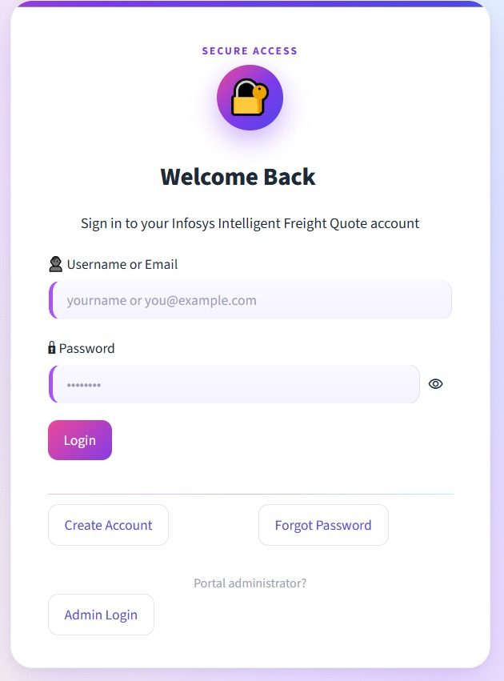
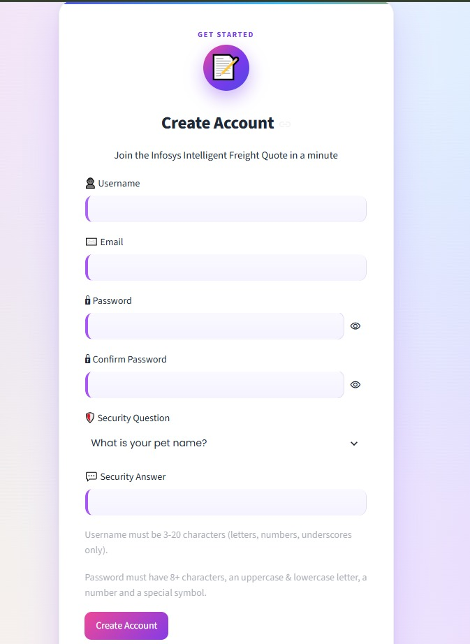
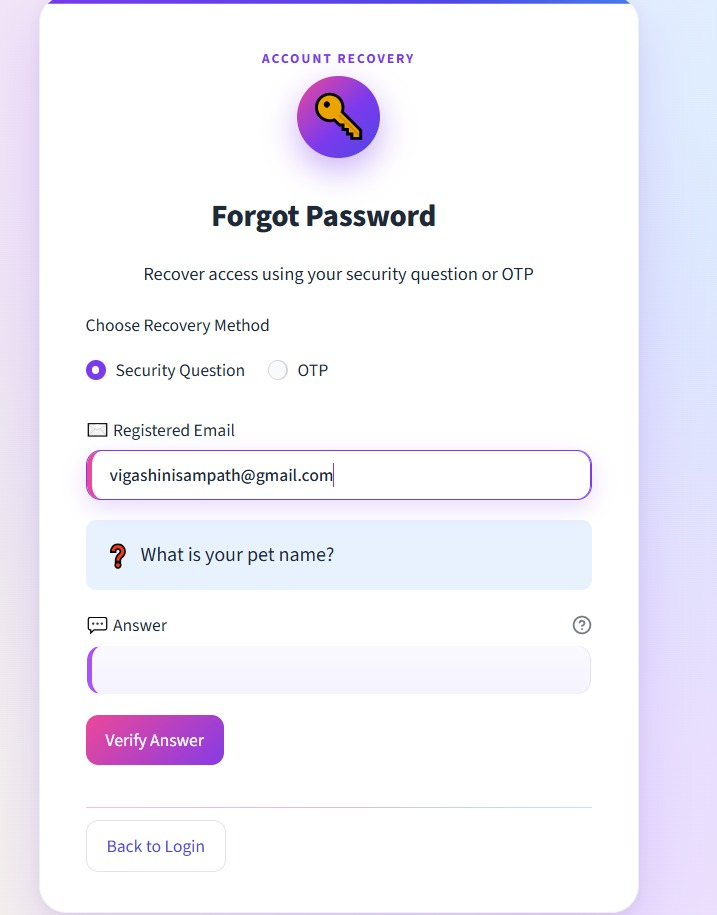
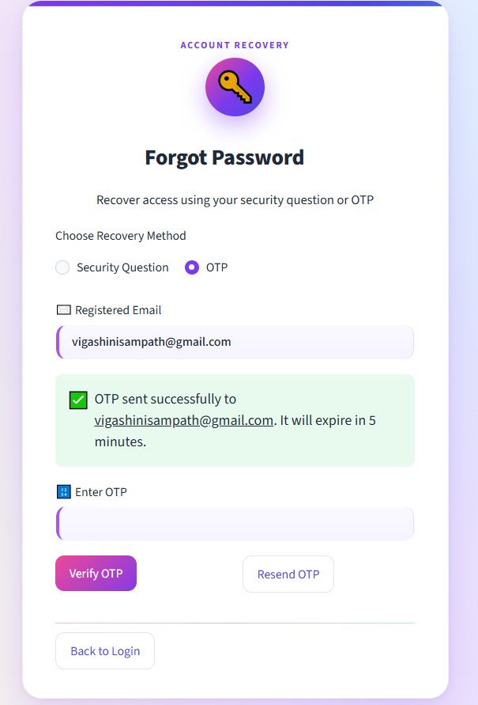
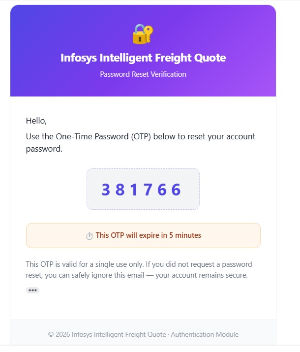
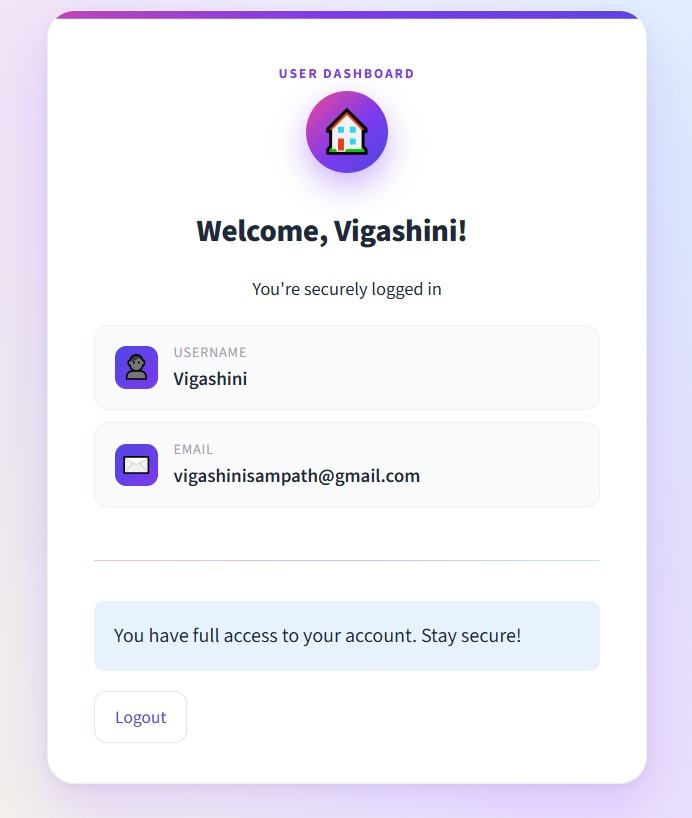
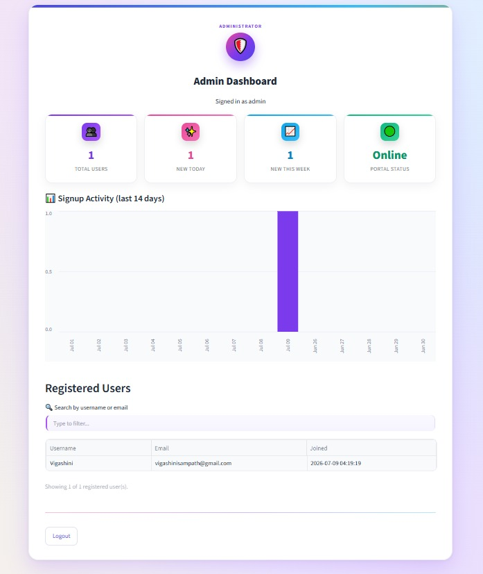

# 🔐 Infosys Springboard Internship 7.0  
## Agentic AI for Maritime Freight Pricing and Route Optimization  
### Milestone 1 — Secure User Authentication Module

---

## 📖 Project Overview

The **User Authentication Module** is the first milestone of the **Infosys Springboard Internship 7.0** project, *Agentic AI for Maritime Freight Pricing and Route Optimization*.

The objective of this milestone is to develop a **secure, reliable, and user-friendly authentication system** that can serve as the entry point to the larger Agentic AI application.

The module provides secure mechanisms for:

- New user registration
- User login
- Password protection
- Forgot-password recovery
- Security-question verification
- Gmail-based OTP verification
- JWT-based authenticated sessions
- Login-attempt monitoring
- Temporary account locking
- Administrative monitoring

The application is implemented using **Python and Streamlit**, with **SQLite** used for persistent data storage. Passwords are protected using **bcrypt hashing**, while **JSON Web Tokens (JWT)** are used to maintain authenticated user sessions.

For development and demonstration, the application is executed through **Google Colab** and exposed through a secure **ngrok tunnel**.

> **Security principle:** Plain-text passwords are never stored in the database. Only securely generated password hashes are stored.

---

# 🎯 Objectives

The primary objectives of Milestone 1 are:

1. Build a complete user authentication workflow.
2. Secure user passwords using industry-standard hashing.
3. Implement authenticated sessions using JWT.
4. Provide multiple password-recovery mechanisms.
5. Verify users through Gmail OTP authentication.
6. Protect sensitive configuration using Google Colab Secrets.
7. Implement login-attempt monitoring and account locking.
8. Provide an administrator dashboard for user monitoring.
9. Create a foundation that can be integrated with future Agentic AI modules.

---

# ✨ Key Features

## 👤 1. User Registration

The registration module allows new users to create an account.

### Registration process

- User enters a username.
- User provides an email address.
- User creates a password.
- Password confirmation is required.
- User selects a security question.
- User provides an answer to the security question.
- The system checks whether the username and email are already registered.
- The password is hashed using **bcrypt**.
- User information is stored in the SQLite database.

### Security

The original password is **never stored directly**. Instead:

```text
Plain Password
      │
      ▼
   bcrypt
      │
      ▼
Password Hash
      │
      ▼
   SQLite
```

This ensures that even if the database is accessed, the original passwords are not directly exposed.

---

# 🔑 2. User Login

Registered users can authenticate using their email address and password.

### Login workflow

```text
Email + Password
       │
       ▼
Check User Exists
       │
       ▼
Verify bcrypt Hash
       │
       ▼
Authentication Successful
       │
       ▼
Generate JWT
       │
       ▼
Protected Dashboard
```

The system verifies the entered password against the stored bcrypt hash.

After successful authentication, a **JWT token** is generated and used to maintain the user's authenticated session.

### Additional protection

The authentication system includes:

- Failed-login tracking
- Login-attempt limiting
- Account locking after repeated failures
- Generic authentication error messages

Generic error messages help avoid revealing whether a particular email address is registered.

---

# 🔐 3. JWT-Based Session Management

**JSON Web Token (JWT)** is used to maintain authenticated sessions.

After successful login:

```text
User Credentials
      │
      ▼
Authentication
      │
      ▼
JWT Token Generated
      │
      ▼
Session Maintained
      │
      ▼
Protected Pages
```

The JWT is signed using a secret key stored securely in **Google Colab Secrets**.

The application can use the token to determine whether the current user has been authenticated before allowing access to protected resources.

---

# 🔄 4. Forgot Password

The application provides password recovery through two verification mechanisms.

### Recovery methods

```text
              Forgot Password
                     │
              ┌──────┴──────┐
              ▼             ▼
      Security Question   Gmail OTP
              │             │
              ▼             ▼
        Verification    Verification
              │             │
              └──────┬──────┘
                     ▼
               Reset Password
```

---

## 🔐 4.1 Security Question Recovery

Users can recover their account by answering the security question configured during registration.

### Workflow

1. User selects **Forgot Password**.
2. User enters the registered email.
3. System retrieves the associated security question.
4. User provides the answer.
5. System verifies the answer.
6. If verification succeeds, the user can create a new password.
7. The new password is securely hashed before being stored.

---

## 📧 4.2 Gmail OTP Recovery

The second recovery mechanism uses a **One-Time Password (OTP)** sent to the user's registered Gmail address.

### Workflow

```text
Forgot Password
      │
      ▼
Registered Email
      │
      ▼
Generate OTP
      │
      ▼
Gmail SMTP
      │
      ▼
User's Email
      │
      ▼
Enter OTP
      │
      ▼
Verify OTP
      │
      ▼
Reset Password
```

The OTP is designed to be temporary and is invalidated after its expiration period or successful verification.

This provides an additional layer of identity verification before allowing a password reset.

---

# 🛡️ Security Features

Security is a major focus of this milestone.

| Security Feature | Purpose |
|---|---|
| **bcrypt** | Securely hashes passwords |
| **JWT** | Maintains authenticated sessions |
| **OTP** | Provides email-based identity verification |
| **Login Attempt Limiting** | Reduces repeated unauthorized attempts |
| **Account Locking** | Temporarily protects accounts after multiple failures |
| **Password History** | Helps prevent reuse of previous passwords |
| **Generic Error Messages** | Reduces unnecessary information disclosure |
| **Google Colab Secrets** | Protects sensitive credentials |
| **Admin Access Control** | Restricts administrative functionality |
| **Password Hash Storage** | Prevents plain-text password storage |

---

# 👨‍💼 Admin Dashboard

The application includes a protected **Admin Dashboard** for monitoring registered users.

The administrator can:

- View registered users.
- View registration information.
- Monitor account-related details.
- Access administrative information through a protected interface.

### Important security principle

**Passwords are never displayed in the administrator dashboard.**

Only appropriate account information and password-related metadata can be displayed.

---

# 🗄️ Database Design

The application uses **SQLite** as its lightweight relational database.

The database is responsible for storing information required for:

- User registration
- Authentication
- Password recovery
- Security questions
- Login attempts
- Account status
- Password history
- OTP-related information

A simplified conceptual structure is:

```text
                    ┌─────────────────────┐
                    │      USERS          │
                    ├─────────────────────┤
                    │ User ID             │
                    │ Username            │
                    │ Email               │
                    │ Password Hash       │
                    │ Security Question   │
                    │ Security Answer     │
                    │ Account Status      │
                    │ Login Attempts      │
                    └──────────┬──────────┘
                               │
             ┌─────────────────┼─────────────────┐
             │                 │                 │
             ▼                 ▼                 ▼
     Password History     OTP Verification    Login Control
```

---

# 🏗️ System Architecture

The overall architecture of Milestone 1 can be represented as follows:

```text
┌─────────────────────────────────────────────────────────────────┐
│                         USER / ADMIN                            │
└──────────────────────────────┬──────────────────────────────────┘
                               │
                               ▼
┌─────────────────────────────────────────────────────────────────┐
│                       STREAMLIT UI                              │
│                                                                 │
│  Login │ Signup │ Forgot Password │ Dashboard │ Admin Panel    │
└──────────────────────────────┬──────────────────────────────────┘
                               │
                               ▼
┌─────────────────────────────────────────────────────────────────┐
│                  AUTHENTICATION LOGIC                           │
│                                                                 │
│  Validation │ bcrypt │ JWT │ OTP │ Login Attempts │ Locking   │
└───────────────┬───────────────────┬─────────────────────────────┘
                │                   │
                ▼                   ▼
┌────────────────────────┐   ┌──────────────────────────────┐
│      SQLite DB         │   │        Gmail SMTP            │
│                        │   │                              │
│ Users                  │   │ OTP Generation & Delivery   │
│ Password History       │   └──────────────┬───────────────┘
│ Login Information      │                  │
└────────────────────────┘                  ▼
                                   ┌──────────────────┐
                                   │  User's Gmail    │
                                   └──────────────────┘

                ┌──────────────────────────────┐
                │     Google Colab Secrets     │
                │                              │
                │ JWT_SECRET                   │
                │ NGROK_AUTHTOKEN              │
                │ EMAIL_ADDRESS                │
                │ EMAIL_PASSWORD               │
                └──────────────┬───────────────┘
                               │
                               ▼
                     ┌─────────────────────┐
                     │       ngrok         │
                     │ Public HTTPS Tunnel │
                     └─────────────────────┘
```

---

# 🔄 Complete Authentication Workflow

The complete system workflow is:

```text
                         ┌──────────────┐
                         │     USER     │
                         └──────┬───────┘
                                │
                     ┌──────────▼──────────┐
                     │   Streamlit UI      │
                     └──────────┬──────────┘
                                │
             ┌──────────────────┼──────────────────┐
             │                  │                  │
             ▼                  ▼                  ▼
        ┌─────────┐        ┌─────────┐      ┌──────────────┐
        │ Signup  │        │  Login  │      │ Forgot Pass. │
        └────┬────┘        └────┬────┘      └──────┬───────┘
             │                  │                  │
             ▼                  ▼             ┌────┴────┐
       Validate Data       Verify Password    │         │
             │                  │             ▼         ▼
             ▼                  ▼        Security     Gmail
        bcrypt Hash          Generate       Ques.       OTP
             │                  │             │         │
             ▼                  ▼             └────┬────┘
          SQLite               JWT                 │
             │                  │                  ▼
             │                  ▼             Reset Password
             │              Dashboard             │
             │                                     ▼
             └──────────────────────────────►   SQLite
```

---

# 🌐 Deployment and Access

During development, the application is executed in **Google Colab**.

Since Colab does not directly provide a permanent public web address, **ngrok** is used to create a public tunnel to the Streamlit application.

```text
Google Colab
     │
     ▼
Streamlit Application
     │
     ▼
Port 8501
     │
     ▼
ngrok Tunnel
     │
     ▼
Public URL
     │
     ▼
User Browser
```

This allows mentors and authorized users to access the application remotely for demonstration and testing.

---

# 🔒 Google Colab Secrets

Sensitive credentials are stored using **Google Colab Secrets** rather than hardcoding them in the notebook.

| Secret | Purpose |
|---|---|
| `JWT_SECRET` | Signs and verifies JWT tokens |
| `NGROK_AUTHTOKEN` | Authenticates the ngrok tunnel |
| `EMAIL_ADDRESS` | Gmail account used for OTP delivery |
| `EMAIL_PASSWORD` | Gmail App Password used for SMTP authentication |

### Security Practice

Credentials should **never** be committed to GitHub.

Instead of:

```python
JWT_SECRET = "my-secret-key"
```

the application retrieves the secret securely from the Colab environment.

---

# 🚀 Installation and Setup

Install the required Python packages:

```bash
pip install streamlit pyjwt bcrypt pyngrok plotly streamlit-option-menu
```

The notebook should then be executed in the appropriate order to:

1. Install dependencies.
2. Load secrets.
3. Initialize the database.
4. Start the authentication application.
5. Start the ngrok tunnel.
6. Access the generated public URL.

---

# 🌐 ngrok Configuration

To create an ngrok tunnel:

### Step 1 — Create an ngrok account

Create an account through the official ngrok dashboard.

### Step 2 — Obtain the Authtoken

Copy the generated authentication token.

### Step 3 — Store it securely

Add the token to Google Colab Secrets using:

```text
NGROK_AUTHTOKEN
```

### Step 4 — Authenticate ngrok

```python
from pyngrok import ngrok

ngrok.set_auth_token(NGROK_AUTHTOKEN)
```

### Step 5 — Create the tunnel

```python
public_url = ngrok.connect(8501)
print(public_url)
```

The generated URL can then be used to access the Streamlit application.

---

# 🔑 JWT Secret Generation

A strong random secret should be generated for signing JWT tokens.

```python
import secrets

print(secrets.token_hex(32))
```

The generated value should be stored as:

```text
JWT_SECRET
```

inside Google Colab Secrets.

The secret should **not** be committed to GitHub or shared publicly.

---

# 📧 Gmail SMTP Configuration

The OTP functionality uses Gmail SMTP.

### Setup requirements

1. Enable **Google 2-Step Verification**.
2. Open the Google Account security settings.
3. Create a Gmail **App Password**.
4. Store the Gmail address in:
   ```text
   EMAIL_ADDRESS
   ```
5. Store the generated App Password in:
   ```text
   EMAIL_PASSWORD
   ```

The Gmail App Password should be used instead of exposing the actual Gmail account password.

---

# 📁 Project Structure

```text
Milestone1/
│
├── Milestone1.ipynb
├── README.md
│
└── screenshots/
    ├── login.jpeg
    ├── signup.jpeg
    ├── forgot_security.jpeg
    ├── forgot_otp.jpeg
    ├── otp_email.jpeg
    ├── dashboard.jpeg
    └── admin_dashboard.jpeg
```


---

# 📸 Application Screenshots

## 🔑 Login Page



The login interface allows registered users to authenticate using their email address and password.

After successful authentication, the application creates a JWT-based session and provides access to protected functionality.

---

## 👤 Signup Page



The signup interface allows users to create a new account.

The system validates the submitted information and securely hashes the password using bcrypt before storing it in SQLite.

---

## 🔐 Forgot Password — Security Question



Users can verify their identity using the security question configured during registration.

Successful verification allows the user to securely create a new password.

---

## 📧 Forgot Password — Gmail OTP



Users can request an OTP to their registered Gmail address.

The password-reset process continues only after successful OTP verification.

---

## 📩 OTP Email



The application generates and sends a temporary OTP using Gmail SMTP.

The OTP is designed to provide an additional verification layer during password recovery.

---

## 📊 User Dashboard



After successful authentication, the user is redirected to a protected dashboard.

Access to this area is controlled through the authentication/session mechanism.

---

## 👨‍💼 Admin Dashboard



The administrator dashboard provides an interface for monitoring registered users and account information.

Sensitive password information is never displayed.

---

# 🧩 Module Breakdown

The Milestone 1 implementation can be divided into the following logical modules:

| Module | Responsibility |
|---|---|
| **Registration Module** | Creates and validates new user accounts |
| **Login Module** | Authenticates registered users |
| **Password Module** | Hashes and validates passwords |
| **JWT Module** | Creates and validates authentication tokens |
| **OTP Module** | Generates and verifies email OTPs |
| **Password Recovery Module** | Handles security-question and OTP recovery |
| **Database Module** | Manages SQLite data |
| **Security Module** | Handles account protection and login restrictions |
| **Admin Module** | Provides administrative monitoring |
| **Deployment Module** | Runs Streamlit through ngrok |

---


---

# 📊 Technology Stack

| Category | Technology | Role in Project |
|---|---|---|
| Programming Language | **Python** | Core application development |
| Frontend / UI | **Streamlit** | Interactive web interface |
| Database | **SQLite** | Persistent user and authentication data |
| Authentication | **JWT** | Session and token-based authentication |
| Password Security | **bcrypt** | Secure password hashing |
| Email Service | **Gmail SMTP** | OTP delivery |
| Development Environment | **Google Colab** | Notebook-based development and execution |
| Public Access | **ngrok** | Secure public tunnel |
| Visualization | **Plotly** | Dashboard visualizations |
| UI Navigation | **streamlit-option-menu** | Navigation and menu components |

---

# 🎓 Learning Outcomes

Through this milestone, the project demonstrates practical understanding of:

- User authentication architecture
- Secure password storage
- bcrypt password hashing
- JWT-based authentication
- SQLite database management
- OTP generation and verification
- Gmail SMTP integration
- Password recovery mechanisms
- Login-attempt protection
- Account-locking mechanisms
- Secret management
- Streamlit application development
- ngrok-based application exposure
- Basic security best practices

---


# 🔮 Role in the Overall Agentic AI Project

Milestone 1 acts as the **secure entry layer** for the larger Agentic AI system.

The expected overall architecture can be viewed as:

```text
                    ┌──────────────────────┐
                    │        USER          │
                    └──────────┬───────────┘
                               │
                               ▼
                    ┌──────────────────────┐
                    │ Authentication Layer │
                    │     Milestone 1      │
                    └──────────┬───────────┘
                               │
                         Successful
                       Authentication
                               │
                               ▼
              ┌─────────────────────────────────┐
              │       Agentic AI Platform       │
              │                                 │
              │ Freight Pricing Agent           │
              │ Route Optimization Agent        │
              │ Weather/Risk Agent              │
              │ Cost Analysis Agent             │
              │ Recommendation Agent            │
              └─────────────────────────────────┘
                               │
                               ▼
                    ┌──────────────────────┐
                    │ Freight Decision /   │
                    │ Route Recommendation │
                    └──────────────────────┘
```

Thus, the authentication module provides the **security foundation** required before users can access the future freight pricing, route optimization, and other Agentic AI capabilities.

---

# ✅ Milestone 1 Summary

The **User Authentication Module** successfully establishes a secure authentication foundation for the Agentic AI maritime freight application.

The implementation combines:

**Streamlit + Python + SQLite + bcrypt + JWT + Gmail OTP + Google Colab Secrets + ngrok**

to provide registration, login, password recovery, authenticated dashboards, administrative monitoring, and multiple security mechanisms.

This milestone demonstrates how a secure authentication layer can be designed and integrated as the first component of a larger **Agentic AI for Maritime Freight Pricing and Route Optimization** platform.

---

