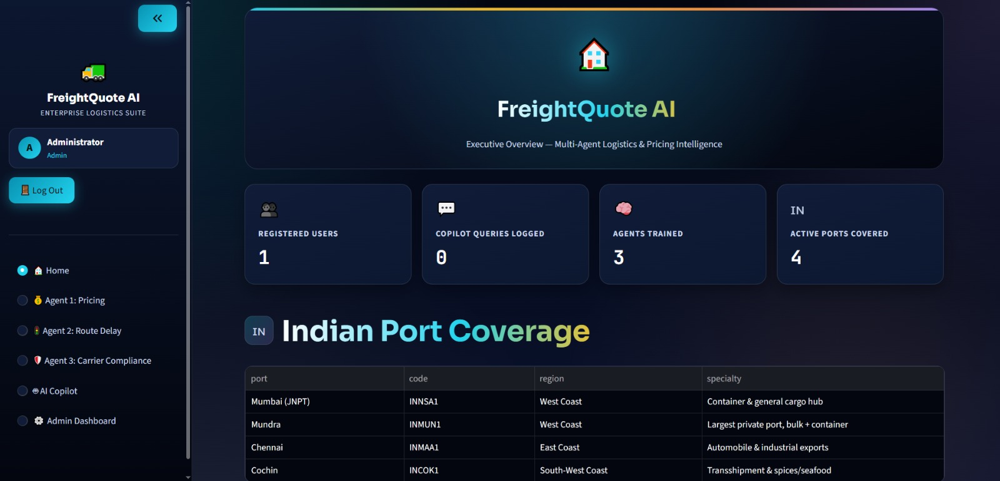
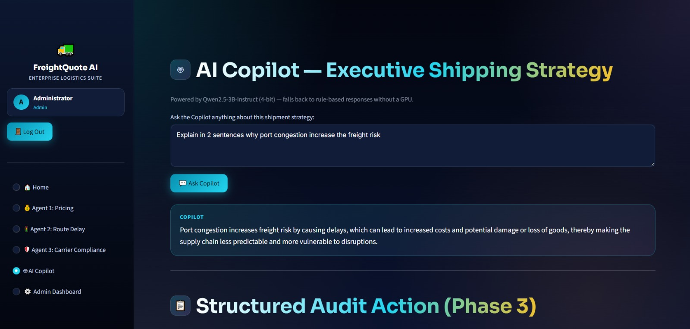
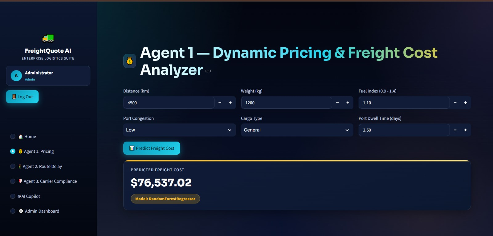
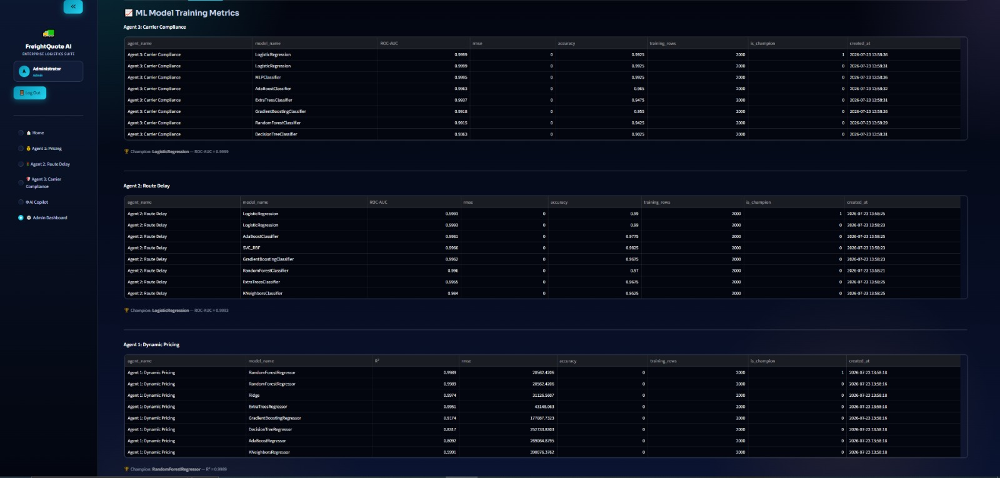
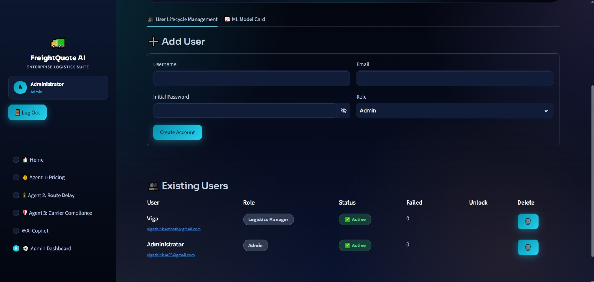
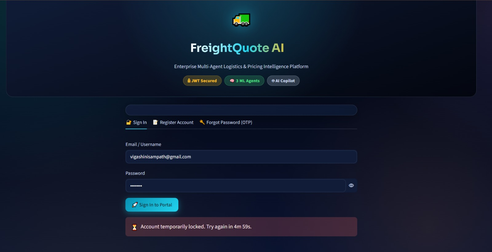
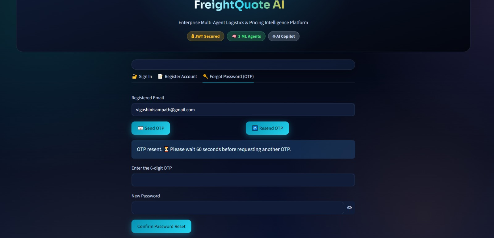

# 🚢 FreightQuote AI Platform — Milestone 2

## 📌 What Milestone 2 Adds on Top of Milestone 1

Milestone 1 established the foundation of the FreightQuote AI Platform by implementing a secure authentication system with **JWT-based session management**, a **Streamlit user interface**, **SQLite database integration**, and **Gmail OTP verification** for password recovery.

Milestone 2 significantly extends the platform by integrating intelligent Machine Learning models, an AI-powered logistics assistant, and enterprise-level security mechanisms. The project evolves from a simple authentication system into a complete AI-powered freight analytics platform capable of providing pricing predictions, route risk analysis, compliance monitoring, and intelligent decision support.

### 🔐 Enhanced Security Features

#### Progressive Account Lockout
To protect user accounts from brute-force login attempts, the application implements a progressive lockout mechanism.

- After **3 consecutive failed login attempts**, the account is locked for **5 minutes**.
- After the **4th failed attempt**, the lock duration increases to **15 minutes**.
- After the **5th failed attempt**, the account becomes permanently locked until an administrator unlocks it through the Admin Dashboard.

---

#### OTP Resend Rate Limiting

To prevent OTP abuse and spam requests, resend cooldowns increase progressively.

| OTP Request | Cooldown |
|-------------|-----------|
| First Resend | 60 Seconds |
| Second Resend | 3 Minutes |
| Third Resend | 5 Minutes |
| Fourth & Above | 1 Hour |

---

#### Real-Time Password Strength Checker

Password strength is validated while users register or reset their password.

| Password Length | Strength | Status |
|-----------------|----------|--------|
| Less than 5 Characters | 🔴 Weak | Registration Blocked |
| 5 – 9 Characters | 🟡 Average | Allowed with Warning |
| 10+ Characters | 🟢 Good | Recommended |

---

## 🤖 Intelligent AI Features Added in Milestone 2

### Multi-Agent Machine Learning Engine

Milestone 2 introduces three independent AI agents, each solving a different logistics problem. Every agent is trained using **two Kaggle logistics datasets** and compares **seven different Machine Learning algorithms** before automatically selecting the best-performing model.

### Agent 1 – Dynamic Freight Pricing

Predicts estimated freight transportation costs based on multiple shipment parameters such as weight, distance, congestion level, shipment type, and destination.

### Agent 2 – Route Delay Classifier

Predicts whether a shipment is likely to experience delays using historical transportation patterns and logistics features.

### Agent 3 – Carrier Compliance Sentinel

Analyzes carrier performance and predicts compliance risks by evaluating shipment history, operational metrics, and logistics records.

---

## 🤖 AI Logistics Copilot

Milestone 2 also integrates an AI-powered logistics assistant using **Qwen2.5-3B-Instruct (4-bit NF4 Quantized Model)**.

The AI Copilot allows users to:

- Ask logistics-related questions in natural language.
- Receive shipment recommendations.
- Understand ML prediction results.
- Generate executive summaries.
- Produce structured JSON audit reports using outputs from all three ML agents.

This provides an interactive decision-support system for freight management.

---

## 👨‍💼 Admin Dashboard

A dedicated administrator panel has been introduced to simplify system administration.

The dashboard allows administrators to:

- Add new users.
- Delete existing users.
- Unlock permanently locked accounts.
- Monitor machine learning model performance.
- Manage user roles.
- View authentication status.
- Access ML Model Card showing evaluation metrics for all AI agents.

Only users with the **Admin** role can access these administrative features.

---

# 🛠 Technology Stack

| Layer | Technology |
|--------|------------|
| User Interface | Streamlit |
| Authentication | bcrypt, PyJWT, SQLite |
| Machine Learning | Scikit-Learn, Joblib |
| Large Language Model | Qwen2.5-3B-Instruct (4-bit via Transformers & BitsAndBytes) |
| Public Deployment | pyngrok |
| Data Source | kagglehub (with seeded synthetic fallback support) |

---

# 🏗 System Architecture

| Phase | Module | Responsibility |
|--------|---------|---------------|
| **Phase 1 – Security Gateway** | auth.py | Handles Login, Registration, Forgot Password, Gmail OTP Verification, JWT Authentication, Password Strength Validation, and Progressive Account Lockout. Stores encrypted credentials and account status securely in SQLite. |
| **Phase 2 – Domain Intelligence** | train_ml_freight.py | Trains and evaluates three autonomous Machine Learning agents for Freight Pricing, Route Delay Prediction, and Carrier Compliance analysis before selecting the best-performing models. |
| **Phase 3 – Generative Advisory** | llm_engine_freight.py | Uses the Qwen2.5 LLM to combine outputs from all ML agents and generate intelligent logistics recommendations together with structured JSON audit actions. |
| **Phase 4 – System Administration** | admin_dash.py | Provides administrative tools including Add User, Delete User, Unlock Account, and ML Model Card. Accessible only to authenticated Admin users. |

---

# 🇮🇳 Indian Port Coverage

| Port | Code | Region | Specialty |
|------|------|--------|-----------|
| Mumbai (JNPT) | INNSA1 | West Coast | India's largest container port handling international cargo and commercial shipments. |
| Mundra | INMUN1 | West Coast | Largest private commercial port supporting container, bulk cargo, and industrial logistics. |
| Chennai | INMAA1 | East Coast | Major export hub for automobiles, manufacturing industries, and engineering goods. |
| Cochin | INCOK1 | South-West Coast | Strategic transshipment port supporting seafood exports, spices, and international trade. |

---

# 📂 Milestone 2 Project Folder Structure

```text
Milestone2/
│
├── FreightQuote_AI_Milestone2.ipynb
├── README.md
├── requirements.txt
│
├── auth.py
├── db.py
├── admin_dash.py
├── ui_theme.py
├── train_ml_freight.py
├── llm_engine_freight.py
│
└── screenshots/
    ├── home.jpeg
    ├── copilotjpeg
    ├── pricing_calculator.jpeg
    ├── admin_model_card.jpeg
    ├── admin_user_actions.jpeg
    └── account_lockout.jpeg
    └── otp_cooldown.jpeg
    
```

---

# ⚙ Setup — Colab Secrets & Kaggle API

### Step 1 – Configure Colab Secrets

Open your notebook in Google Colab and click the **🔑 Secrets** icon available in the left sidebar.

Create the following secrets and enable notebook access for each one:

- JWT_SECRET_KEY
- ADMIN_EMAIL_ID
- ADMIN_PASSWORD
- NGROK_AUTHTOKEN
- HF_TOKEN
- EMAIL_ID *(Optional)*
- EMAIL_PASSWORD *(Optional)*
- KAGGLE_USERNAME *(Optional)*
- KAGGLE_KEY *(Optional)*

---

### Step 2 – Configure Kaggle API

1. Log in to **Kaggle**.
2. Open **Profile → Settings**.
3. Scroll to the **API** section.
4. Click **Create New Token**.
5. Download the **kaggle.json** file.
6. Copy the Username and Key into the corresponding Colab Secrets.

If Kaggle credentials are unavailable, the notebook automatically switches to a seeded synthetic dataset so the application continues to function normally.

---

### Step 3 – Gmail OTP Configuration

To enable real email-based OTP verification:

1. Enable **2-Step Verification** on your Gmail account.
2. Navigate to **Google Account → Security → App Passwords**.
3. Generate a new App Password.
4. Store it as **EMAIL_PASSWORD** in Colab Secrets.

If these credentials are not configured, OTP codes will be printed in the notebook console instead, allowing the complete authentication workflow to remain functional.

---

# ▶ How to Run the Project

### Step 1

Open **FreightQuote_AI_Milestone2.ipynb** in Google Colab.

### Step 2

Change the runtime to:

**Runtime → Change Runtime Type → T4 GPU → Save**

This allows the Qwen2.5 language model to load efficiently.

### Step 3

Execute every notebook cell sequentially from top to bottom.

During execution:

- Authentication system initializes.
- Machine Learning models are trained.
- Best-performing models are selected.
- AI Copilot is loaded.
- Streamlit application starts.
- Ngrok generates a public HTTPS URL.

### Step 4

Open the generated URL in your browser.

Login using:

```
Email:
infosys@ai

Password:
admin@123
```

(or use the credentials stored in your Colab Secrets.)

### Step 5

When finished, execute the final notebook cell to stop the Streamlit application and release GPU resources.

---

# 📸 Screenshots

### 🏠 Home Dashboard



Displays the application's Home Dashboard after successful login. It provides users with a quick overview of platform features, key statistics, and navigation to the AI modules.

---

### 🤖 AI Copilot



Shows the AI Copilot interface with a user prompt and the generated response from the Qwen2.5 language model. It demonstrates the platform's ability to answer logistics questions and generate intelligent recommendations.

---

### 📊 Freight Pricing Calculator



Illustrates the Freight Pricing Calculator where shipment parameters are entered to predict transportation cost. The screenshot highlights the real-time ML prediction generated by the pricing model.

---

### 📈 ML Model Card



Displays the ML Model Card inside the Admin Dashboard. It presents evaluation metrics such as R² Score and ROC-AUC for all three trained Machine Learning agents.

---

### 👨‍💼 Admin User Management



Shows the administrative user management interface. It demonstrates how administrators can add new users, delete existing accounts, and unlock permanently locked users from a single dashboard.

---

### 🔒 Account Lockout



Shows the Progressive Account Lockout feature after multiple failed login attempts. The screenshot displays the security message informing the user that the account has been temporarily or permanently locked to prevent unauthorized access.

---

### ⏳ OTP Cooldown



Displays the OTP resend cooldown notification during the Forgot Password process. It demonstrates how the system enforces increasing waiting periods between OTP requests to prevent spam and abuse.
### ⏳ otp_cooldown.jpeg

Displays the OTP resend cooldown notification during the Forgot Password process. It demonstrates how the system enforces increasing waiting periods between OTP requests to prevent spam and abuse.
