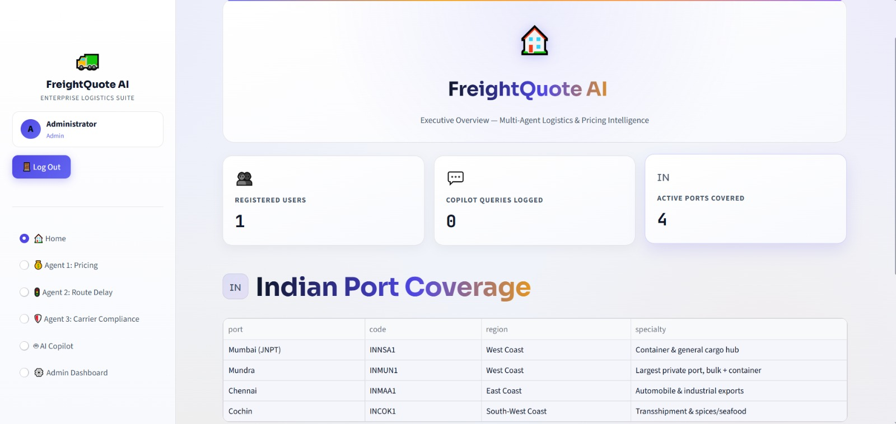
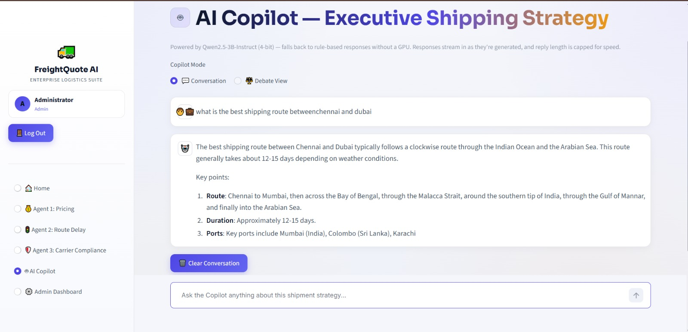
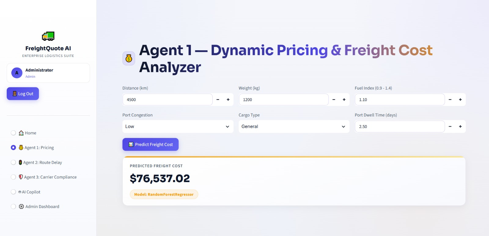
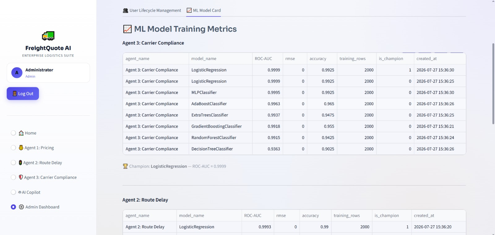
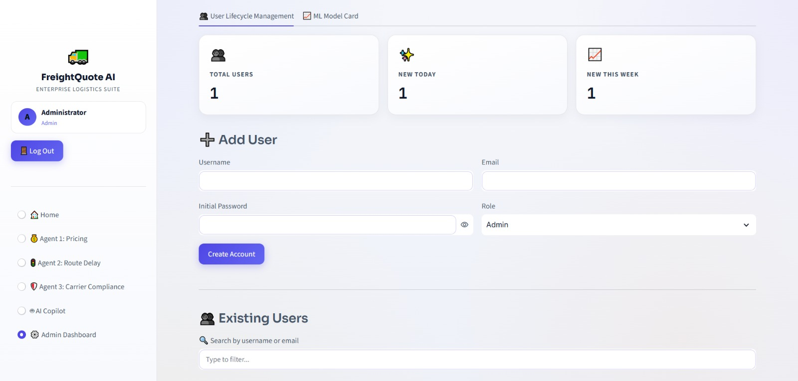
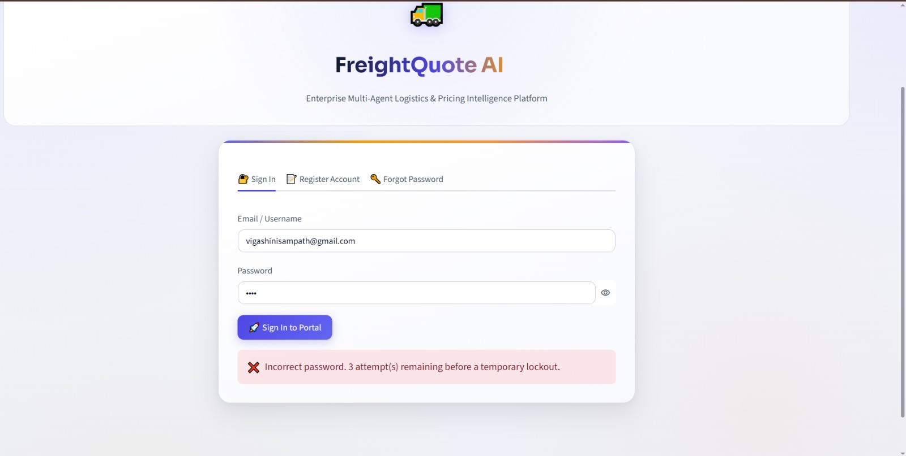
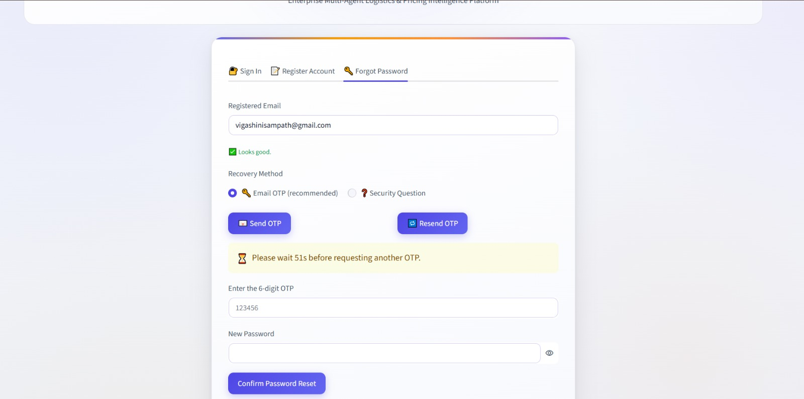

# 🚢 Agentic AI for Maritime Freight Pricing and Route Optimization — Milestone 2

## 📌 Project Overview

**FreightQuote AI** is an AI-powered maritime freight decision-support platform developed as part of the **Infosys Springboard Internship 7.0**.

Milestone 1 established the foundation with secure user authentication, JWT-based session management, SQLite integration, Streamlit UI, and Gmail OTP-based password recovery.

**Milestone 2 extends this foundation by introducing Machine Learning, an AI-powered Logistics Copilot, enhanced security mechanisms, and an administrative management dashboard.**

The system can analyse freight-related information, predict transportation costs, identify possible route delays, evaluate carrier compliance risks, and provide intelligent recommendations through a natural-language AI assistant.

---

## 🎯 Objectives of Milestone 2

- Extend authentication with stronger security controls.
- Introduce multiple Machine Learning agents for freight intelligence.
- Predict freight transportation costs.
- Identify potential shipment delays.
- Analyse carrier compliance risks.
- Integrate a local Large Language Model as an AI Logistics Copilot.
- Provide administrators with user and ML model management tools.
- Compare multiple ML algorithms and select suitable models.
- Establish a foundation for additional maritime intelligence agents.

---

## 📌 What Milestone 2 Adds on Top of Milestone 1

```text
                 MILESTONE 1
                     │
                     ▼
        ┌─────────────────────────┐
        │ Secure Authentication   │
        │ Registration • Login    │
        │ JWT • SQLite • Gmail OTP│
        └────────────┬────────────┘
                     │
                     ▼
                 MILESTONE 2
                     │
        ┌────────────┼────────────┐
        ▼            ▼            ▼
   ML Agents    AI Copilot    Admin Tools
   Pricing      Qwen LLM      User Management
   Delay        Logistics     ML Model Card
   Compliance   Assistant     Security Controls
```

---

# 🔐 Enhanced Security Features

## 1. Progressive Account Lockout

The system protects user accounts against repeated incorrect login attempts.

| Failed Attempts | Account Status | Lock Duration |
|---|---|---|
| 1–2 | Login allowed | No lock |
| 3 | Temporarily locked | 5 minutes |
| 4 | Temporarily locked | 15 minutes |
| 5+ | Permanently locked | Administrator unlock required |

### Workflow

```text
Incorrect Password
       ↓
Failed Attempt Counter
       ↓
Attempts < 3 ──→ Continue Login
       │
       ▼
Attempts ≥ 3
       ↓
Temporary Lock
       ↓
Repeated Failures
       ↓
Permanent Lock
       ↓
Admin Unlock Required
```

## 2. OTP Resend Rate Limiting

| OTP Request | Cooldown |
|---|---:|
| First Resend | 60 seconds |
| Second Resend | 3 minutes |
| Third Resend | 5 minutes |
| Fourth & Above | 1 hour |

## 3. Real-Time Password Strength Checker

| Password Length | Strength | Status |
|---|---|---|
| Less than 5 characters | 🔴 Weak | Registration blocked |
| 5–9 characters | 🟡 Average | Allowed with warning |
| 10+ characters | 🟢 Good | Recommended |

---

# 🤖 Intelligent AI Features

Milestone 2 introduces a **Multi-Agent Machine Learning Engine** consisting of three independent AI agents.

```text
                Logistics Dataset
                       │
                       ▼
              Data Preprocessing
                       │
          ┌────────────┼────────────┐
          ▼            ▼            ▼
       Agent 1      Agent 2      Agent 3
       Pricing       Delay      Compliance
          │            │            │
          ▼            ▼            ▼
      ML Models     ML Models    ML Models
          │            │            │
          └────────────┼────────────┘
                       ▼
                Model Evaluation
                       │
                       ▼
                Best Model Selection
                       │
                       ▼
                   AI Copilot
```

## 🤖 Agent 1 — Dynamic Freight Pricing

Predicts estimated freight transportation costs using shipment parameters such as weight, distance, congestion, shipment type, and destination.

**ML Type:** Regression

**Evaluation Metrics:** R² Score, RMSE

## 🚚 Agent 2 — Route Delay Classifier

Predicts whether a shipment is likely to experience transportation delays using historical transportation and logistics patterns.

**ML Type:** Classification

**Evaluation Metrics:** Accuracy, F1 Score, ROC-AUC

## 🛡️ Agent 3 — Carrier Compliance Sentinel

Analyses carrier performance and operational information to predict potential compliance risks.

**ML Type:** Classification

**Evaluation Metrics:** Accuracy, F1 Score, ROC-AUC

---

# 🧠 Machine Learning Model Selection

The ML pipeline evaluates multiple algorithms rather than relying on a single model.

```text
Input Dataset
     ↓
Data Cleaning
     ↓
Feature Processing
     ↓
Multiple ML Models
     ↓
Model Evaluation
     ↓
Metric Comparison
     ↓
Best Model Selected
     ↓
Prediction Engine
```

The project evaluates multiple Machine Learning algorithms across the three agents and records their performance metrics.

---

# 🤖 AI Logistics Copilot

Milestone 2 introduces an AI-powered **Logistics Copilot** using **Qwen2.5-3B-Instruct — 4-bit NF4 Quantized Model**.

### Key Capabilities

- Ask logistics-related questions.
- Understand ML prediction results.
- Request freight recommendations.
- Analyse shipment information.
- Generate executive summaries.
- Combine outputs from multiple ML agents.
- Generate structured JSON audit reports.

### Copilot Workflow

```text
User Question
     ↓
AI Copilot Interface
     ↓
Query Processing
     ↓
ML Agent Results + Application Data
     ↓
Qwen2.5 LLM
     ↓
Intelligent Response
     ├── User-Friendly Answer
     └── JSON Audit Report
```

---

# 👨‍💼 Admin Dashboard

Only authenticated users with the **Admin** role can access administrative features.

### User Management

- Add users
- Delete users
- Manage user roles
- Unlock permanently locked accounts
- View authentication status

### ML Model Monitoring

The **ML Model Card** provides:

- Model performance
- Evaluation metrics
- Agent-specific results
- Selected models

---

# 🔐 Role-Based Access Control

| Role | Access |
|---|---|
| **Admin** | Complete platform, user management and ML monitoring |
| **Operations Manager / Freight Broker** | Freight analytics and AI Copilot |
| **Dispatcher** | Selected operational features and Copilot |
| **Customer / Client** | Quote-related functionality and Copilot |

---

# 🏗️ System Architecture

| Phase | Module | Responsibility |
|---|---|---|
| **Phase 1 — Security Gateway** | `auth.py` | Registration, login, password recovery, Gmail OTP, JWT authentication, password strength validation and progressive account lockout |
| **Phase 2 — Domain Intelligence** | `train_ml_freight.py` | Training and evaluation of three ML agents and model selection |
| **Phase 3 — Generative Advisory** | `llm_engine_freight.py` | Combines ML outputs and generates recommendations and JSON audit reports |
| **Phase 4 — System Administration** | `admin_dash.py` | User management, account unlocking and ML Model Card |

### Architecture Diagram

```text
                         ┌─────────────────────┐
                         │       USER          │
                         └──────────┬──────────┘
                                    │
                                    ▼
                    ┌────────────────────────────┐
                    │       Streamlit UI         │
                    │ Dashboard / Login / Chat  │
                    └──────────────┬─────────────┘
                                   │
              ┌────────────────────┼────────────────────┐
              ▼                    ▼                    ▼
      ┌──────────────┐    ┌────────────────┐   ┌───────────────┐
      │Authentication │    │   ML Engine    │   │Admin Dashboard│
      │ JWT + bcrypt │    │ 3 AI Agents    │   │User + Models  │
      └───────┬──────┘    └───────┬────────┘   └───────┬───────┘
              │                    │                    │
              ▼                    ▼                    │
      ┌──────────────┐    ┌────────────────┐            │
      │    SQLite    │    │ Model Selection│            │
      │   Database   │    │ & Prediction   │            │
      └──────────────┘    └───────┬────────┘            │
                                  │                     │
                                  └──────────┬──────────┘
                                             ▼
                                  ┌─────────────────────┐
                                  │   AI Logistics      │
                                  │      Copilot        │
                                  │ Qwen2.5-3B-Instruct │
                                  └──────────┬──────────┘
                                             │
                                             ▼
                                  ┌─────────────────────┐
                                  │ Recommendations &   │
                                  │ JSON Audit Reports  │
                                  └─────────────────────┘
```

---

# 🇮🇳 Indian Port Coverage

| Port | Code | Region | Specialty |
|---|---|---|---|
| **Mumbai (JNPT)** | INNSA1 | West Coast | Major container port supporting international cargo and commercial shipments |
| **Mundra** | INMUN1 | West Coast | Major private commercial port supporting container, bulk and industrial logistics |
| **Chennai** | INMAA1 | East Coast | Major export hub for automobiles, manufacturing and engineering goods |
| **Cochin** | INCOK1 | South-West Coast | Strategic port supporting seafood, spices and international trade |

---

# 🛠️ Technology Stack

| Layer | Technology | Purpose |
|---|---|---|
| User Interface | Streamlit | Web interface and dashboard |
| Authentication | bcrypt | Secure password hashing |
| Authentication | PyJWT | JWT-based session management |
| Database | SQLite | User and application data storage |
| Machine Learning | Scikit-Learn | Classification and regression models |
| Model Persistence | Joblib | Saving and loading trained ML models |
| Large Language Model | Qwen2.5-3B-Instruct | AI Logistics Copilot |
| Quantization | BitsAndBytes | 4-bit NF4 model loading |
| LLM Framework | Transformers | Loading and running Qwen |
| Public Deployment | pyngrok | Public HTTPS access |
| Data Source | Kaggle / kagglehub | Logistics datasets |
| Fallback Data | Synthetic Seeded Data | Keeps the ML pipeline functional when Kaggle data is unavailable |
| Development | Google Colab | Notebook-based development and GPU execution |

---

# 📂 Project Structure

```text
Milestone2/
│
├── FreightQuote_AI_Milestone2.ipynb
├── README.md
├── requirements.txt
│
├── auth.py
├── db.py
├── admin_dash.py
├── ui_theme.py
├── train_ml_freight.py
├── llm_engine_freight.py
│
└── screenshots/
    ├── home.jpeg
    ├── copilot.jpeg
    ├── pricing_calculator.jpeg
    ├── admin_model_card.jpeg
    ├── admin_user_actions.jpeg
    ├── account_lockout.jpeg
    └── otp_cooldown.jpeg
```

---

# 🔒 Colab Secrets Configuration

Sensitive credentials are stored using **Google Colab Secrets** rather than being hard-coded.

### Required Secrets

| Secret | Purpose |
|---|---|
| `JWT_SECRET_KEY` | JWT authentication secret |
| `ADMIN_EMAIL_ID` | Administrator email |
| `ADMIN_PASSWORD` | Administrator password |
| `NGROK_AUTHTOKEN` | ngrok authentication token |
| `HF_TOKEN` | Hugging Face token |

### Optional Secrets

| Secret | Purpose |
|---|---|
| `EMAIL_ID` | Gmail account used for OTP |
| `EMAIL_PASSWORD` | Gmail App Password |
| `KAGGLE_USERNAME` | Kaggle username |
| `KAGGLE_KEY` | Kaggle API key |

**Sensitive credentials must never be committed to GitHub.**

---

# 📊 Kaggle API Configuration

1. Log in to Kaggle.
2. Open **Profile → Settings**.
3. Navigate to the **API** section.
4. Select **Create New Token**.
5. Download `kaggle.json`.
6. Store the required credentials in Google Colab Secrets.

If Kaggle credentials are unavailable, the project can switch to its seeded synthetic dataset fallback.

---

# 📧 Gmail OTP Configuration

1. Enable Google 2-Step Verification.
2. Open **Google Account → Security**.
3. Navigate to **App Passwords**.
4. Generate an App Password.
5. Store the Gmail address in `EMAIL_ID`.
6. Store the App Password in `EMAIL_PASSWORD`.

The actual Gmail account password should never be stored in the application.

If email credentials are unavailable, OTP codes can be displayed in the notebook console for development/testing according to the project configuration.

---

# 🚀 Installation

```bash
pip install streamlit pyjwt bcrypt pyngrok scikit-learn joblib
pip install transformers bitsandbytes accelerate
pip install kagglehub
```

Or:

```bash
pip install -r requirements.txt
```

---

# ▶️ How to Run

### Step 1 — Open the Notebook

Open `FreightQuote_AI_Milestone2.ipynb` in Google Colab.

### Step 2 — Enable GPU

```text
Runtime
   ↓
Change Runtime Type
   ↓
T4 GPU
   ↓
Save
```

### Step 3 — Configure Secrets

Configure the required credentials in the Google Colab **Secrets** section.

### Step 4 — Execute the Notebook

Run all cells sequentially.

```text
Install Dependencies
        ↓
Load Secrets
        ↓
Initialize Database
        ↓
Load / Generate Dataset
        ↓
Train ML Models
        ↓
Evaluate Models
        ↓
Select Best Models
        ↓
Load Qwen2.5 LLM
        ↓
Initialize Authentication
        ↓
Start Streamlit
        ↓
Create Public Tunnel
```

### Step 5 — Access the Application

Open the generated ngrok URL in a browser.

Use the configured administrator credentials or the credentials provided for the demo environment.

> **Security Note:** Do not publish real administrator credentials in the GitHub README or source code.

---

# 🔄 End-to-End Application Workflow

```text
                    USER
                     │
                     ▼
              Login / Signup
                     │
                     ▼
          Authentication & JWT
                     │
                     ▼
             Role Verification
                     │
        ┌────────────┴────────────┐
        │                         │
        ▼                         ▼
    User Access              Admin Access
        │                         │
        ▼                         ▼
   AI Copilot             User Management
        │                  ML Model Card
        │                  Account Unlock
        ▼
 ┌──────┼────────┬───────────────┐
 ▼      ▼        ▼
Pricing Delay  Compliance
Agent   Agent   Agent
 └──────┴────────┴───────────────┘
               │
               ▼
        Model Predictions
               │
               ▼
        Qwen2.5 Copilot
               │
               ▼
 Recommendations / Audit Report
```

---

# 📸 Application Screenshots

## 🏠 Home Dashboard



Displays the Home Dashboard after successful login and provides navigation to the platform's major features.

## 🤖 AI Logistics Copilot



Shows the AI Copilot interface using Qwen2.5. Users can ask freight and logistics-related questions and receive intelligent recommendations.

## 📊 Freight Pricing Calculator



Demonstrates freight pricing prediction using shipment-related input parameters.

## 📈 ML Model Card



Displays model evaluation information available to administrators.

## 👨‍💼 Admin User Management



Shows administrator functions such as adding users, deleting accounts, managing roles, and unlocking permanently locked accounts.

## 🔒 Progressive Account Lockout



Demonstrates the progressive account lockout mechanism after repeated failed login attempts.

## ⏳ OTP Cooldown



Shows the OTP resend cooldown mechanism during password recovery.

---

# 🧪 Security Testing

| Test Scenario | Expected Behaviour |
|---|---|
| Correct login credentials | User successfully logs in |
| Incorrect password | Failed-attempt counter increases |
| Three consecutive failures | Account locked for 5 minutes |
| Fourth failed attempt | Lock duration increases |
| Repeated failures | Account becomes permanently locked |
| OTP resend | Cooldown is applied |
| Multiple OTP requests | Progressive cooldown increases |
| Weak password | Registration/reset blocked |
| Strong password | Password accepted |
| Non-admin accessing Admin Dashboard | Access denied |
| Admin unlocking account | Locked account becomes accessible |

---

# 📊 Expected Outputs

### Authentication
- Secure registration
- Secure login
- JWT sessions
- Password recovery
- Gmail OTP
- Password strength validation
- Progressive account lockout

### Machine Learning
- Freight price prediction
- Route delay classification
- Carrier compliance prediction
- Model comparison
- Model performance metrics
- Best-model selection

### AI Copilot
- Natural-language logistics interaction
- ML result interpretation
- Freight recommendations
- Executive summaries
- JSON audit reports

### Administration
- User management
- Account unlocking
- Role management
- Authentication monitoring
- ML Model Card

---

# 🌟 Milestone 2 Highlights

The major achievement of Milestone 2 is the evolution of FreightQuote AI from a basic authentication platform into an **AI-powered maritime freight analytics and decision-support system**.

- 🔐 Stronger authentication and account security
- 🤖 Three independent Machine Learning agents
- 💰 Dynamic freight pricing prediction
- 🚚 Route delay prediction
- 🛡️ Carrier compliance risk analysis
- 🧠 Qwen2.5-powered Logistics Copilot
- 👨‍💼 Role-based Admin Dashboard
- 📊 ML model evaluation and comparison
- 📧 OTP-based password recovery
- 🔒 Progressive account lockout
- ⏳ OTP resend rate limiting
- 🔑 Real-time password strength validation
- 🌐 Public access through ngrok
- 🇮🇳 Indian port coverage

---

# 🎓 Learning Outcomes

- Machine Learning model development
- Classification and regression
- Model evaluation and selection
- AI/LLM integration
- Quantized LLM deployment
- Prompt-based decision support
- Authentication security
- JWT session management
- Role-Based Access Control
- OTP security
- Streamlit application development
- SQLite database management
- Kaggle dataset integration
- Google Colab GPU deployment
- Public application deployment using ngrok

---

