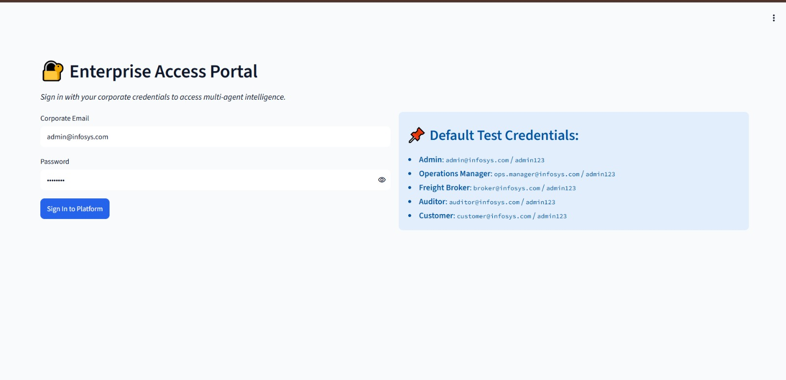
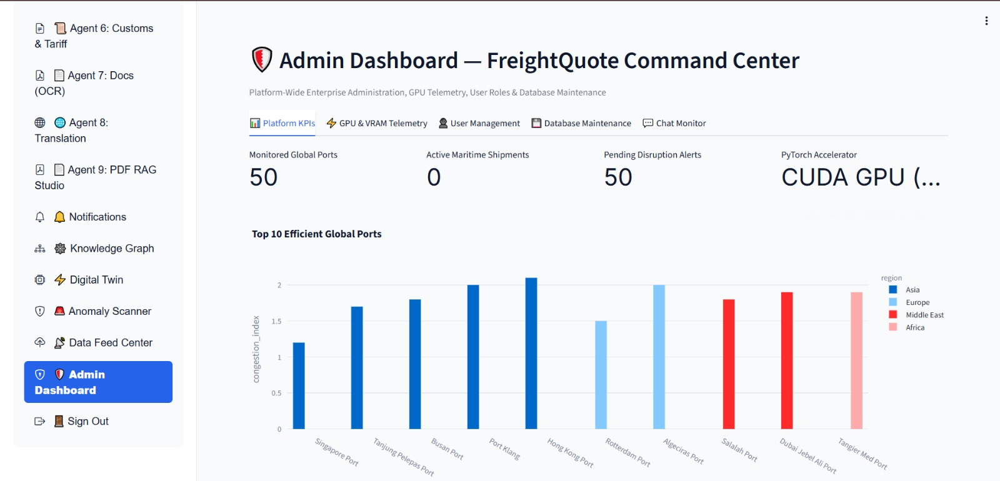
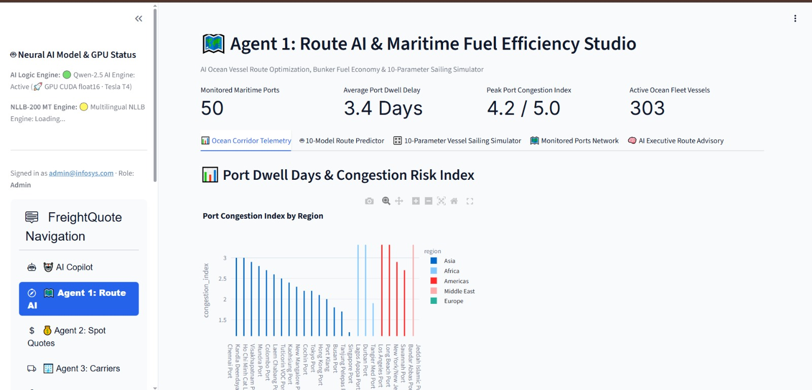
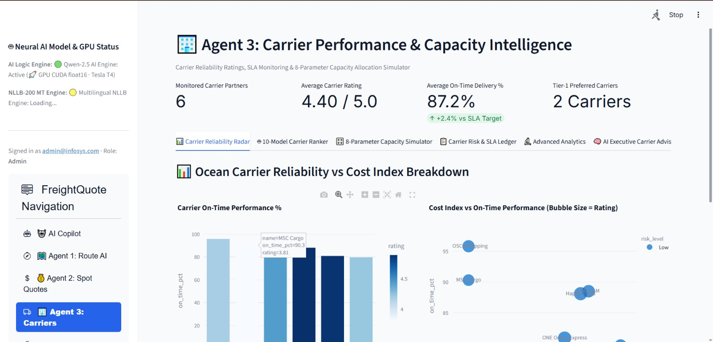
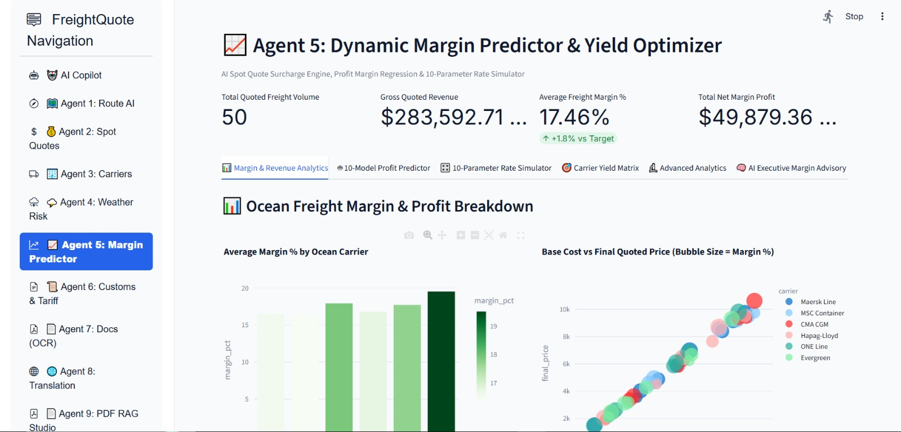
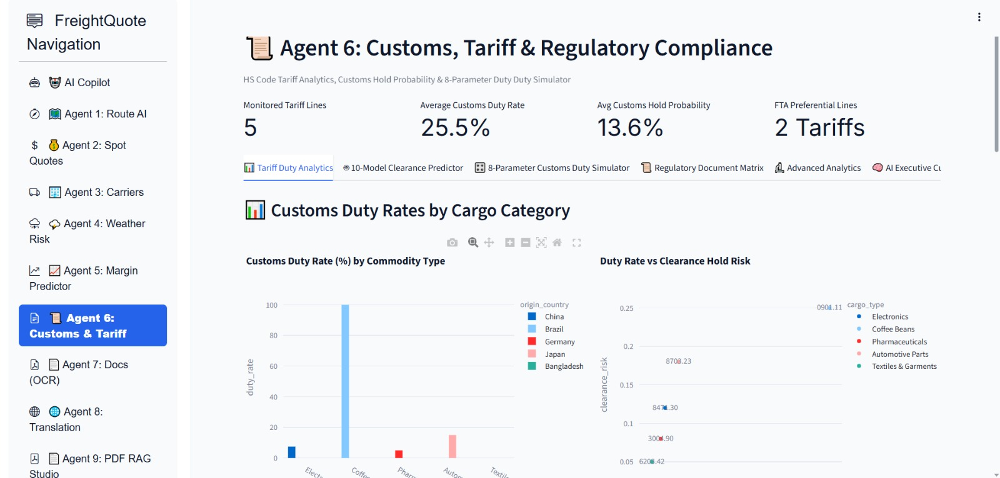
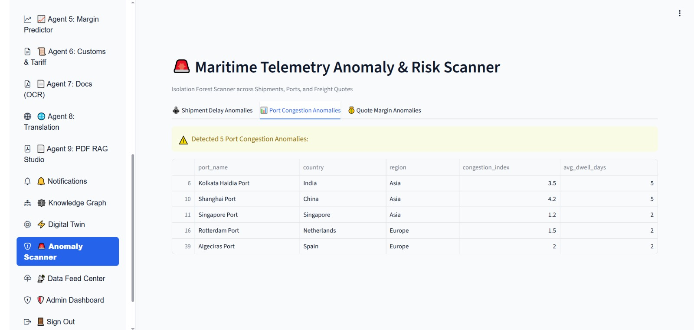
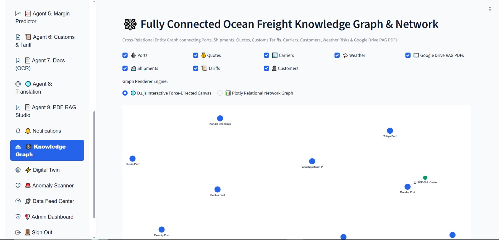
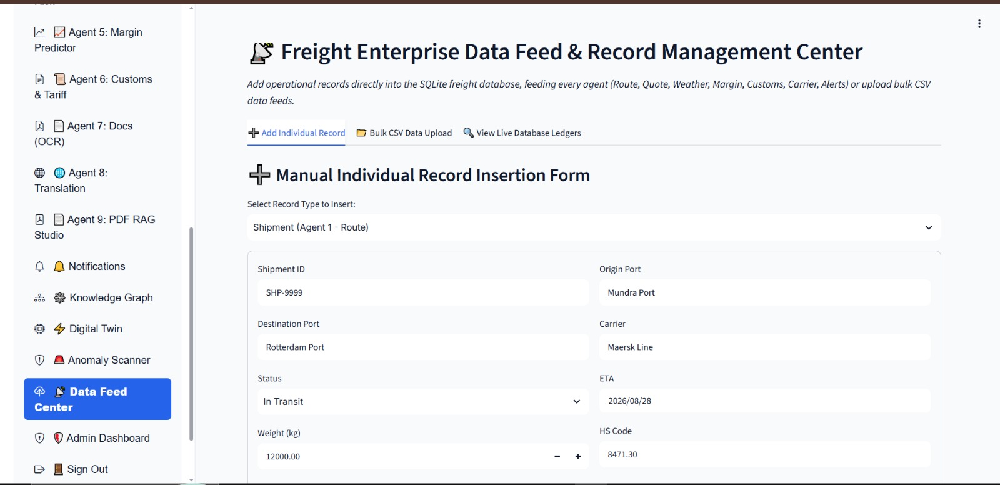

# Agentic AI for Maritime Freight Pricing & Route Optimization

**Infosys Springboard Internship — Milestone 4**

FreightQuote AI is a maritime freight decision-support application that combines multiple AI agents, machine-learning models, document retrieval, route analysis, pricing tools, and an AI Copilot in one Streamlit-based platform.

The main goal of Milestone 4 is to bring the individual capabilities developed during the earlier milestones into a more connected application where users can analyse shipments, compare carriers, estimate freight costs, inspect weather and customs risks, and ask questions through a grounded AI assistant.

---

## 🎯 What We Completed in Milestone 4

Milestone 4 focuses mainly on **integration, usability, and end-to-end functionality**.

### Core improvements

- Integrated the major AI agents into one Streamlit application
- Added a database-grounded AI Copilot
- Implemented role-based access for different user types
- Added local Qwen LLM support with a smaller-model fallback
- Added multilingual translation using NLLB-200
- Added PDF-based RAG for customs manuals and carrier SOPs
- Added anomaly detection and digital-twin simulation
- Added knowledge-graph visualization
- Added notifications for operational incidents
- Added tools for generating freight documents
- Added public access support through ngrok / Cloudflare Tunnel

---

## 🧩 Main Modules

| Module | Purpose |
|---|---|
| 🤖 AI Copilot | Answers freight-related questions using retrieved application data |
| 🗺 Route Intelligence | Analyses ports, congestion and possible routes |
| 💰 Freight Pricing | Estimates and compares freight quote components |
| 🚢 Carrier Analytics | Reviews carrier reliability and capacity |
| 🌦 Weather Risk | Evaluates weather conditions affecting port operations |
| 📈 Margin Intelligence | Analyses quote profitability and margin behaviour |
| 🛃 Customs Intelligence | Supports customs and HS-code related risk analysis |
| 📄 Document Generator | Creates freight quote and Bill of Lading documents |
| 🌐 Translation | Translates shipping documents and operational text |
| 📚 PDF RAG | Searches uploaded customs and SOP documents |
| 🚨 Notifications | Displays shipment, weather and customs incidents |
| 🕸 Knowledge Graph | Visualizes relationships between freight entities |
| 🧪 Digital Twin | Simulates changes across the freight network |
| 🔎 Anomaly Scanner | Finds unusual patterns in operational data |
| 📡 Data Feed Center | Provides operational data review/export functionality |

---

## 🏗️ Application Architecture

The application can be viewed as four connected stages:

```text
                 ┌──────────────────────────┐
                 │       Streamlit UI       │
                 │ Dashboard + AI Copilot   │
                 └────────────┬─────────────┘
                              │
                 ┌────────────▼─────────────┐
                 │     Agent / Tool Layer   │
                 │ Route • Pricing • Risk  │
                 │ Carrier • Customs • RAG │
                 └────────────┬─────────────┘
                              │
                 ┌────────────▼─────────────┐
                 │     Data & Reasoning     │
                 │ SQLite • ML • FAISS      │
                 │ Route/Quote Calculators  │
                 └────────────┬─────────────┘
                              │
                 ┌────────────▼─────────────┐
                 │     AI Generation Layer │
                 │ Qwen LLM + Translation  │
                 └──────────────────────────┘
```

### How a Copilot request is handled

1. The user's question is classified by the intent router.
2. Relevant information is retrieved from SQLite or a calculation tool.
3. If the answer requires a document, the RAG pipeline searches the indexed PDFs.
4. Retrieved information is passed to the local Qwen model.
5. The Copilot generates an answer based on the available context.
6. NLLB-200 can translate the response when required.

The design aims to keep the Copilot grounded in application data rather than generating unsupported freight values.

---

## 🤖 AI Agents

### Agent 1 — Port & Route Intelligence

Provides route and port analysis using:

- Port congestion information
- Interactive Folium maps
- Great-circle distance calculations
- Sailing-time estimation
- Route/port risk classification
- AI-assisted route recommendations

**Models:** Random Forest, Gradient Boosting, Decision Tree, Logistic Regression, SVC

---

### Agent 2 — Dynamic Freight Pricing

Used for freight quote analysis and cost estimation.

Key capabilities:

- Base freight cost calculation
- Fuel surcharge handling
- Customs/terminal fee calculation
- Regression model comparison
- Cost breakdown visualization
- Pricing recommendations

**Models:** Random Forest Regressor, Gradient Boosting Regressor, Decision Tree Regressor, Linear Regression

---

### Agent 3 — Carrier Performance

Helps compare shipping carriers based on reliability and fleet-related information.

Includes:

- Reliability analysis
- Capacity simulation
- Carrier risk classification
- On-time delivery analysis
- Carrier recommendation support

**Models:** Random Forest, Gradient Boosting, Decision Tree, Logistic Regression, SVC

---

### Agent 4 — Weather & Harbor Risk

Monitors weather conditions around supported ports.

Includes:

- Live weather information
- Storm-severity mapping
- Wind/wave safety analysis
- Weather-risk prediction
- Weather-based recommendations

Weather information is obtained through the Open-Meteo API.

---

### Agent 5 — Freight Margin Intelligence

Examines how different cost components influence profitability.

Includes:

- Rate simulation
- Carrier yield analysis
- Margin prediction
- Cost/margin correlation analysis
- Margin distribution analysis

**Models:** Random Forest Regressor, Gradient Boosting Regressor, Decision Tree Regressor, Linear Regression

---

### Agent 6 — Customs & HS Code Intelligence

Supports customs-risk and regulatory analysis.

Includes:

- Customs duty simulation
- Regulatory document mapping
- Clearance-risk prediction
- Country/cargo analysis
- Customs recommendations

**Models:** Random Forest, Gradient Boosting, Decision Tree, Logistic Regression, SVC

---

### Agent 7 — Freight Document Generator

Automates basic shipping documentation.

Current capabilities include:

- Freight quote PDF generation
- Bill of Lading generation

---

### Agent 8 — Maritime Translation

Provides translation support for freight-related information.

Includes:

- Text translation
- Maritime SOP translation
- Batch translation
- Shipping terminology/glossary support

The translation engine uses NLLB-200.

---

### Agent 9 — PDF RAG Studio

Allows users to work with their own freight-related documents.

Workflow:

```text
Upload PDF
   ↓
Text extraction
   ↓
Chunking
   ↓
Embedding
   ↓
FAISS index
   ↓
Question
   ↓
Relevant document sections
   ↓
Grounded answer
```

This can be used with customs manuals, carrier SOPs and similar operational documents.

---

## 🔐 User Access & Security

The application uses role-based access control.

| Role | Main Access |
|---|---|
| Admin | Complete platform and administration features |
| Ops Manager / Freight Broker | Operational agents and AI Copilot |
| Dispatcher | Copilot and selected operational modules |
| Customer / Client | Copilot and quote-related features |

Authentication includes:

- Email and OTP login
- JWT-based sessions
- Password hashing with bcrypt
- Security questions
- Progressive account lockout
- Role-based menu access

---

## 🧠 Machine Learning Approach

The predictive modules compare multiple classical ML algorithms instead of relying on a single model.

### Classification

Used for areas such as:

- Carrier reliability
- Weather risk
- Customs clearance risk

Typical evaluation metrics:

- Accuracy
- F1 score

### Regression

Used for areas such as:

- Freight pricing
- Freight margin

Typical evaluation metrics:

- R²
- RMSE

The application can compare model results and use the strongest-performing model for relevant predictions.

---

## 📊 Visual Analytics

The platform uses interactive visualizations to make model and operational results easier to understand.

Examples include:

- Bar charts
- Scatter plots
- Box plots
- Histograms
- Heatmaps
- Waterfall charts
- Funnel charts
- Sunburst charts
- Treemaps
- Folium maps

The visualizations are used for both operational monitoring and model comparison.

---

## 🛠️ Technology Stack

| Category | Technology | Usage in the Project |
|---|---|---|
| Frontend / UI | Streamlit | Main dashboard, navigation, forms and AI Copilot interface |
| Backend | Python 3 + FastAPI | Application logic, APIs and model-service integration |
| Database | SQLite | Stores ports, shipments, carriers, quotes, customs and operational data |
| Local LLM | Qwen2.5-3B-Instruct | Generates grounded natural-language responses |
| LLM Fallback | Qwen2.5-1.5B-Instruct | Fallback model when the larger model cannot be loaded |
| Translation | NLLB-200 | Multilingual translation of freight-related text and documents |
| RAG / Vector Search | FAISS + sentence-transformers | Searches uploaded customs manuals and carrier SOPs |
| Machine Learning | scikit-learn | Classification, regression and anomaly-detection models |
| Visualization | Plotly | Interactive analytics charts and model comparisons |
| Maps | Folium + streamlit-folium | Port, route and weather-risk maps |
| Authentication | PyJWT + bcrypt | JWT sessions, password hashing and access control |
| Weather Data | Open-Meteo REST API | Weather information for monitored ports |
| Documents | ReportLab / FPDF | Freight quote and Bill of Lading PDF generation |
| Data Preparation | Kaggle + Faker | Dataset preparation and realistic demo-data generation |
| Deployment | Google Colab + ngrok / Cloudflare Tunnel | GPU execution and public application access |

---

## 🗃️ Data & Storage

SQLite acts as the main application database.

The database stores operational information such as:

- Ports
- Shipments
- Carriers
- Routes
- Freight quotes
- Customs requirements
- Weather-risk information
- Operational records
- ML metrics

Demo data can be generated or prepared through the project's data-seeding pipeline.

---

## 🔄 Milestone 4 Execution Flow

The recommended order for running the complete application is:

```text
Prepare Data
     ↓
Seed SQLite Database
     ↓
Prepare PDF / RAG Index
     ↓
Load Qwen + Translation Engines
     ↓
Start AI Agents
     ↓
Verify Authentication & RBAC
     ↓
Run End-to-End Tests
     ↓
Launch Streamlit
     ↓
Expose Application
```

This order reduces dependency issues because the Copilot and several agents require database and document-retrieval components to be ready first.

---

## 🚀 Running the Project

### Environment

The project is designed to run in **Google Colab**, particularly when local LLM inference requires GPU resources.

### Basic workflow

1. Open the project notebook.
2. Install the required Python packages.
3. Generate or load the application data.
4. Initialize the SQLite database.
5. Prepare the document/RAG index if required.
6. Start the model service.
7. Launch the Streamlit application.
8. Open the generated tunnel URL.

### Demo credentials

For the configured demo environment, use the credentials provided in the project configuration rather than hard-coding credentials into the public repository.

---

## 📁 Project Structure

```text
freight_app/
│
├── app.py
├── admin_dash.py
├── ai_copilot.py
│
├── agent1_route.py
├── agent2_pricing.py
├── agent3_carrier.py
├── agent4_weather.py
├── agent5_margin.py
├── agent6_customs.py
├── agent7_docs.py
├── agent8_translation.py
└── agent9_pdf_rag.py
│
├── anomaly_scanner.py
├── digital_twin.py
├── knowledge_graph.py
├── notifications.py
├── data_feed_center.py
│
├── auth.py
├── rbac.py
├── db.py
├── seed_data.py
├── llm_engine.py
├── translation_engine.py
├── rag_engine.py
├── model_server.py
│
├── config.py
├── ui_theme.py
└── requirements.txt
```

---

## 📸 Application Screenshots

### Login & Access

*Secure sign-in screen with role-based demo credentials.*

### Admin Dashboard

*Command-center overview of shipments, quotes, and platform-wide KPIs.*

### AI Copilot

*Grounded chat assistant answering questions using live freight data.*

### Route Optimization (Agent 1)

*Interactive port-to-port route mapping and optimization analysis.*

### Dynamic Freight Pricing (Agent 2)

*Real-time dynamic pricing engine for freight quotes.*

### Carrier Performance (Agent 3)

*Carrier capacity, reliability, and performance analytics.*

### Weather & Freight Risk (Agent 4)

*Live port weather overlays and shipment risk scoring.*

### Margin Predictor (Agent 5)

*Predicted yield and margin outlook across active shipments.*

### Customs & Tariffs (Agent 6)

*Customs, tax, and compliance guidance for cross-border shipments.*

### Digital Bill of Lading (Agent 7)

*Automated generation and management of shipping documents.*

### Alerts & Translation (Agent 8)

*Real-time incident alerts alongside 20+ language translation support.*

### PDF SOP / RAG Studio (Agent 9)

*Upload and query customs/SOP PDFs using retrieval-augmented search.*

### Anomaly Scanner

*Isolation Forest–based detection of anomalies across shipments and ports.*

### Digital Twin Simulation

*Monte Carlo trade-stress simulation of the global freight network.*

### Knowledge Graph

*Interactive graph linking ports, carriers, shipments, and documents.*

### Data Feed Center

*Manual and bulk CSV data ingestion into the live database.*

---

## 🌟 Milestone 4 Highlights

The major outcome of this milestone is the transition from separate project components to a **single integrated freight-intelligence platform**.

### Key takeaways

- Multiple AI agents can work within one application.
- Operational data and ML predictions are presented together.
- The AI Copilot can use structured database information and retrieved documents.
- RBAC provides different views for different users.
- RAG extends the system beyond structured database queries.
- Route, pricing, weather, carrier and customs analysis can be accessed from one interface.
- Supporting tools such as anomaly detection, digital twin simulation and knowledge graphs provide additional operational insight.

---

## 👥 Team Contribution

This project was developed collaboratively as part of the **Infosys Springboard Internship**. Each team member contributed to different modules of the Milestone 4 integrated platform.

| No. | Team Member | Contribution |
|---|---|---|
| **01** | **Tharani Mahasamudram** | **Dynamic Margin Predictor & Yield Optimizer**; **Customs, Tariff & Regulatory Intelligence**; **Digital Bill of Lading & OCR**; **Alerts & Incidents**; **Knowledge Graph**; **Digital Twin**; **Anomaly/Risk Scanner**; **AI Copilot Quality Requirement** |
| **02** | **Vigashini S** | **GitHub & README Documentation**; **RAG & Data Pipeline**; **User Profile Management**; **Profile Picture Upload**; **Change Password Functionality** |
| **03** | **Megha Ramthirth** | **Extended Admin Dashboard** — Add, Delete, Promote, Demote and Unlock Users; **Route AI & Maritime Fuel Efficiency**; **Dynamic Freight Pricing**; **Carrier Performance & Capacity Intelligence**; **Weather Risk & Storm Telemetry** |
| **04** | **Kamireddy Samatha Sri** | **Signup/Login with OTP Verification**; **Security Question & Security Answer**; **OTP & Security Question Password Recovery**; **Secure Session/JWT Handling**; **Logout Functionality** |

---
