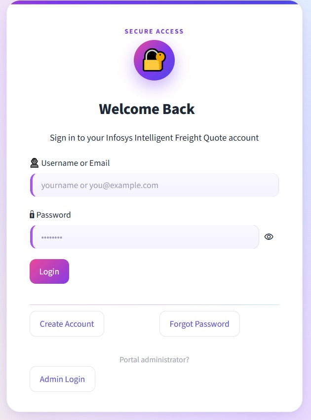
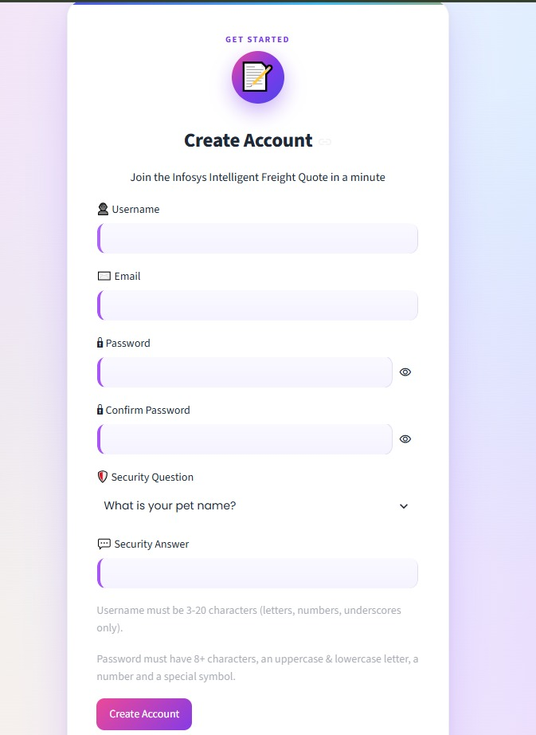
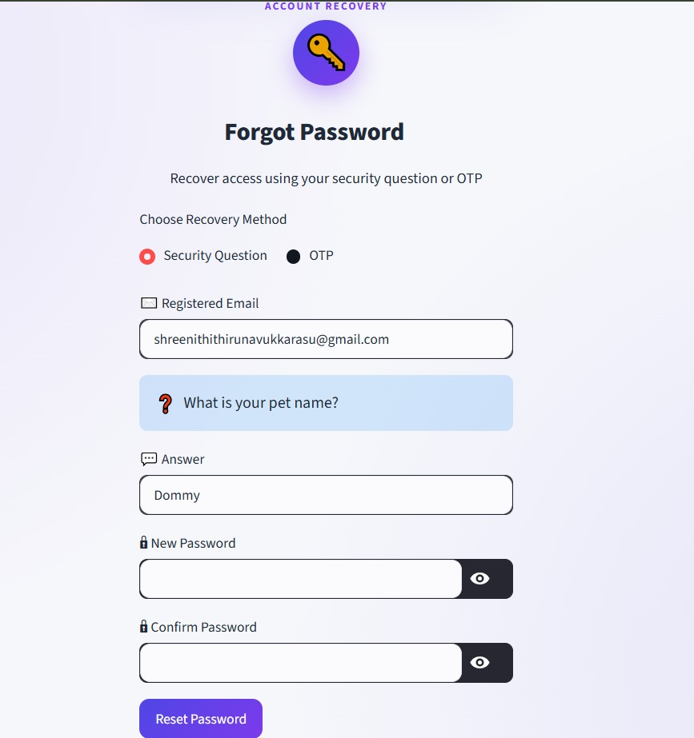
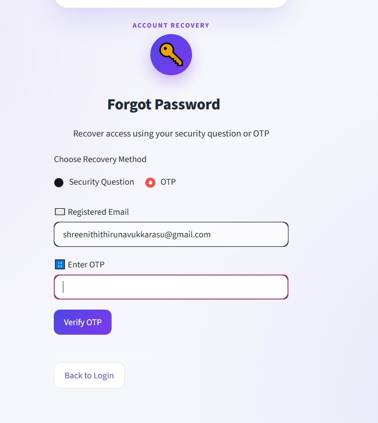
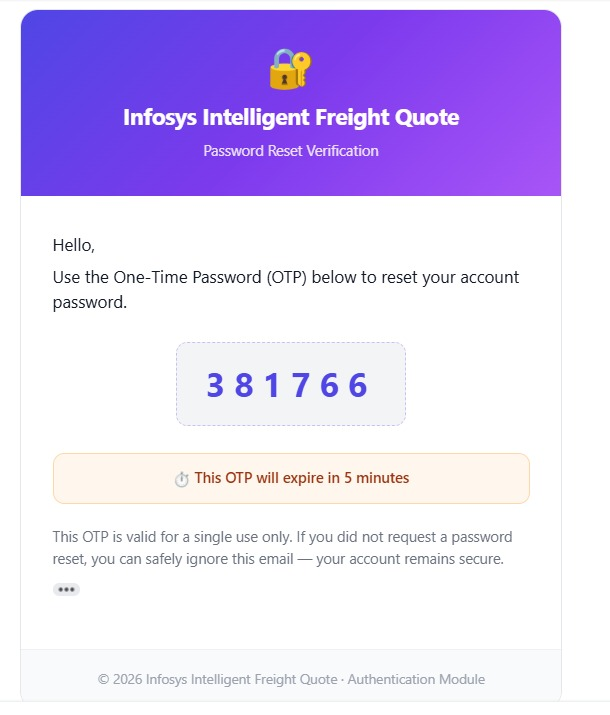
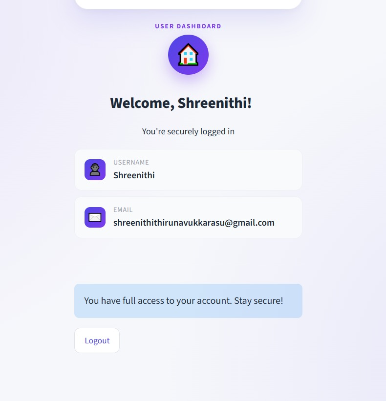
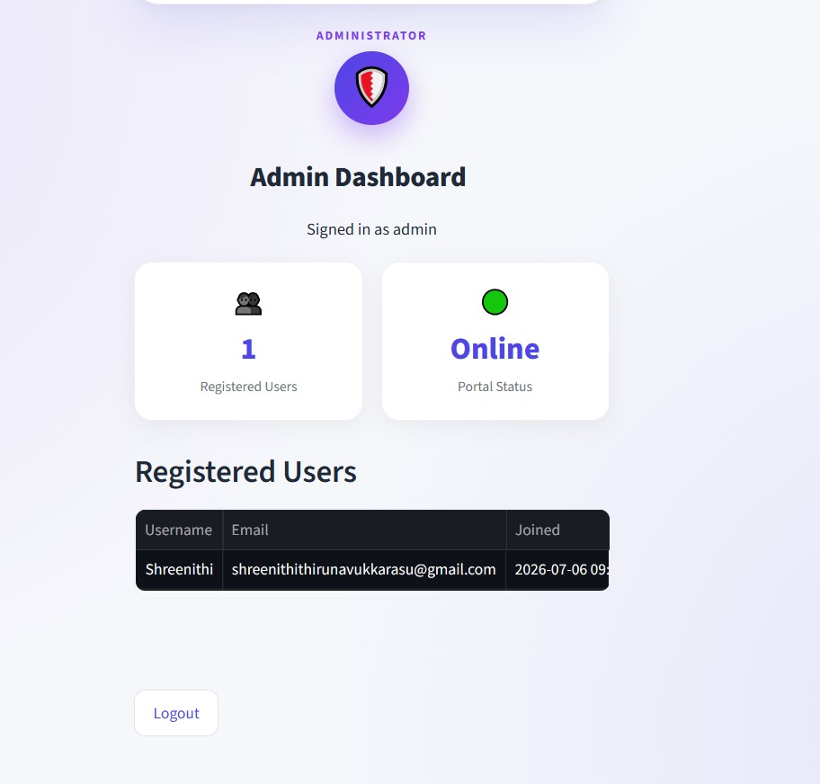

# 🔐 Infosys Springboard Internship 7.0
## Batch 1 – Milestone 1
# User Authentication Module


## 📖 Project Overview
This project was developed as part of **Infosys Springboard Internship 7.0 – Batch 1, Milestone 1**.

It implements a secure authentication system using **Python, Streamlit, SQLite, JWT Authentication, bcrypt, Gmail OTP Verification, Google Colab Secrets, and ngrok**.

Users can register, log in securely, recover passwords, and access protected dashboards while following authentication best practices.

---

# ✨ Features

## 👤 User Registration
- Username & Email registration
- Unique username/email validation
- Password confirmation
- Security question & answer
- Password hashing using bcrypt

## 🔑 Login
- Email & password authentication
- Generic error messages
- JWT session management
- Secure dashboard access

## 🔄 Forgot Password
### Security Question
- Verify security answer
- Reset password securely

### Gmail OTP
- Send OTP to registered email
- Verify OTP
- Reset password

## 🛡 Security
- bcrypt hashing
- JWT authentication
- Password history
- Login attempt limiting
- Account lock
- Gmail OTP
- Google Colab Secrets

## 👨‍💼 Admin Dashboard
- Secure admin login
- View users
- View registration details
- Passwords never displayed

---

# 🛠 Technology Stack

| Technology | Purpose |
|---|---|
| Python | Backend |
| Streamlit | UI |
| SQLite | Database |
| JWT | Authentication |
| bcrypt | Password Hashing |
| Gmail SMTP | OTP |
| pyngrok | Public URL |
| Google Colab | Development |

---

# 📁 Project Structure

```text
Milestone1/
│
├── Milestone1.ipynb
├── README.md
└── screenshots/
    ├── login.jpeg
    ├── signup.jpeg
    ├── forgot_security.jpeg
    ├── forgot_otp.jpeg
    ├── otp_email.jpeg
    ├── dashboard.jpeg
    └── admin_dashboard.jpeg
```

# 🔒 Google Colab Secrets

| Secret | Description |
|---|---|
| JWT_SECRET | JWT signing key |
| NGROK_AUTHTOKEN | ngrok token |
| EMAIL_ADDRESS | Gmail |
| EMAIL_PASSWORD | Gmail App Password |

No credentials are hardcoded.

# 🚀 Installation

```bash
pip install streamlit pyjwt bcrypt pyngrok plotly streamlit-option-menu
```

Run notebook cells in order and open the generated ngrok URL.

# 🌐 Creating an ngrok Token

1. Create a free account at https://dashboard.ngrok.com/signup
2. Login and copy **Your Authtoken**.
3. Save it in Colab Secrets as `NGROK_AUTHTOKEN`.
4. Authenticate:

```python
from pyngrok import ngrok
ngrok.set_auth_token(NGROK_AUTHTOKEN)
```

5. Start tunnel:

```python
public_url = ngrok.connect(8501)
print(public_url)
```

# 🔑 Creating a JWT Secret

```python
import secrets
print(secrets.token_hex(32))
```

Store the generated value as `JWT_SECRET` in Colab Secrets.

# 📧 Gmail App Password

- Enable Google 2-Step Verification.
- Open Google Account → Security → App Passwords.
- Generate a Mail App Password.
- Store:
  - EMAIL_ADDRESS
  - EMAIL_PASSWORD

# 📸 Screenshots

## Login Page


Registered users can log in using their email and password. After successful verification, a JWT token is created to maintain a secure authenticated session.

## Signup Page


Users create a new account with a unique username, email, strong password, and security question. Passwords are hashed using bcrypt before storage.

## Forgot Password – Security Question


Users answer their registered security question to verify identity before securely resetting their password.

## Forgot Password – OTP


A one-time password is sent to the registered Gmail account. The password can be reset only after successful OTP verification.

## OTP Email


The application sends a six-digit OTP using Gmail SMTP. The OTP expires after a short period for improved security.

## User Dashboard


Authenticated users are redirected to a protected dashboard where access is controlled using JWT-based authentication.

## Admin Dashboard


The administrator can monitor registered users and account information while keeping password hashes hidden.

# 🔄 Project Workflow

```text
User
 │
 ├── Signup
 │      │
 │      ▼
 │ Validate → Hash Password → SQLite
 │
 ├── Login
 │      │
 │      ▼
 │ Verify → JWT → Dashboard
 │
 └── Forgot Password
        │
        ├── Security Question
        └── Gmail OTP
                │
                ▼
          Reset Password
```

# 🎯 Learning Outcomes

- Authentication systems
- JWT
- bcrypt
- SQLite
- Streamlit
- Gmail SMTP
- OTP
- Google Colab Secrets
- ngrok deployment

# 🚀 Future Enhancements

- Multi-Factor Authentication
- Email Verification
- Password Strength Meter
- User Profile Management
- Audit Logs
- Docker Deployment

---
Developed for **Infosys Springboard Internship 7.0 – Batch 1 – Milestone 1**
