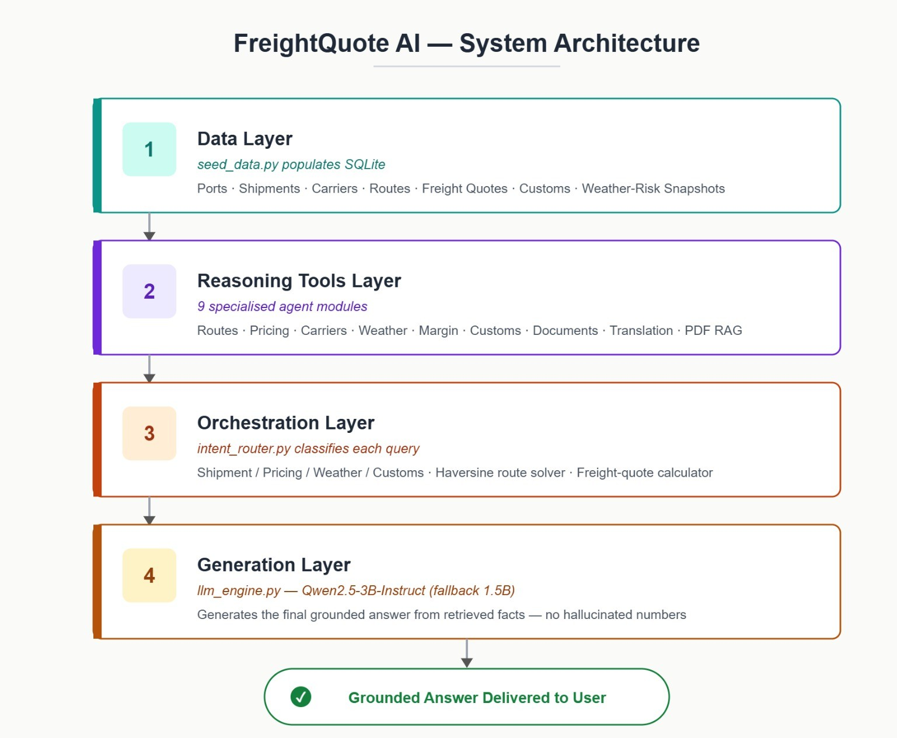
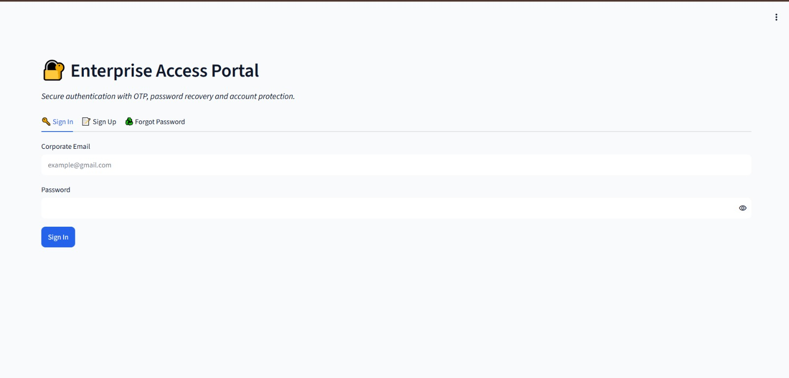

# Agentic AI for Maritime Freight Pricing and Route Optimization
### Codename: FreightQuote AI

*An agentic decision-support copilot for an ocean-freight brokerage — grounded routing, pricing, weather, and compliance answers.*

---

## Table of Contents
- [Program & Team Context](#program--team-context)
- [Overall Project Explanation](#overall-project-explanation)
- [The 9 Specialised Agents](#the-9-specialised-agents)
- [Authentication, OTP & Security](#authentication-otp--security)
- [Admin Dashboard](#admin-dashboard)
- [Screenshots / GIFs](#screenshots--gifs)
- [Installation & Run Instructions](#installation--run-instructions-from-github)
- [Secrets & Credentials](#secrets--credentials)
- [requirements.txt](#requirementstxt)
- [Demo Video](#demo-video)
- [Known Limitations & Future Scope](#known-limitations--future-scope)
- [Acknowledgements](#acknowledgements)

---

## Program & Team Context

**Infosys Springboard Internship — Batch 1**

**Mentor:** `MOHAMEDSIPLI M`

**Final Team Members**

| No. | Team Member | Contribution |
|:---:|:------------|:--------------|
| 01 | Tharani Mahasamudram | Dynamic Margin Predictor & Yield Optimizer; Customs, Tariff & Regulatory Intelligence; Digital Bill of Lading & OCR; Alerts & Incidents; Knowledge Graph; Digital Twin; Anomaly/Risk Scanner; AI Copilot Quality Requirement |
| 02 | Vigashini S | GitHub & README Documentation; Repository Setup & All GitHub Management; `requirements.txt` Creation & Dependency Handling; RAG & Data Pipeline; User Profile Management; Profile Picture Upload; Change Password Functionality |
| 03 | Megha Ramthirth | Extended Admin Dashboard — Add, Delete, Promote, Demote and Unlock Users; Route AI & Maritime Fuel Efficiency; Dynamic Freight Pricing; Carrier Performance & Capacity Intelligence; Weather Risk & Storm Telemetry |
| 04 | Kamireddy Samatha Sri | Signup/Login with OTP Verification; Security Question & Security Answer; OTP & Security Question Password Recovery; Secure Session/JWT Handling; Logout Functionality |

## Overall Project Explanation

### Problem Statement
Ocean-freight brokerages juggle port congestion, volatile fuel-linked pricing, carrier reliability, weather risk, and customs compliance across dozens of live shipments at once — usually across spreadsheets and siloed tools. FreightQuote AI gives brokers, dispatchers, and clients a single agentic copilot that answers routing, pricing, weather, and compliance questions **grounded in real data**, instead of relying on manual lookups or an LLM's guesswork.

### Solution Summary
FreightQuote AI is an agentic decision-support platform for an ocean-freight brokerage. It monitors global ports, calculates dynamic freight quotes, benchmarks carriers, tracks weather and customs risk, and exposes an LLM-powered copilot that answers routing, pricing, weather, and compliance questions using only grounded database facts, live telemetry, and retrieved documents — never fabricated numbers. Nine specialised agents sit on top of a shared platform layer (authentication, RBAC, translation, alerting, admin tooling), all running inside a single Streamlit application launched from Google Colab.

### Architecture Overview

The platform follows a four-layer agentic pattern:



**AI Copilot Answer Pipeline:**
1. `classify_intent()` maps the question to shipment / pricing / weather / customs / carrier domains.
2. `run_grounded_query()` pulls exact rows/aggregates from SQLite, or runs the dedicated route-distance / freight-quote solver for computed questions.
3. If no SQL tool matches, `execute_tool()` falls back to `rag_engine.answer_with_citation()` over the FAISS-indexed document store (customs manuals, carrier SOPs).
4. `generate_grounded_answer()` passes the retrieved facts into Qwen2.5-3B-Instruct with an explicit instruction to answer only from the provided context, in plain business language — never as SQL/Python code — then optionally translates via NLLB-200.

A sidebar status panel — **"🤖 Neural AI Model & GPU Status"** — shows live loading state for both the Qwen and NLLB engines (🟢 Active / 🟡 Loading).

### The 9 Agents at a Glance

| # | Agent | One-Line Purpose |
|:--|:------|:-------------------|
| 1 | Route AI & Maritime Fuel Efficiency Studio | Ocean vessel route optimization, bunker fuel economy & 10-parameter sailing simulator |
| 2 | Dynamic Freight Pricing Engine | Real-time ocean container spot pricing, margin sensitivity & BAF surcharge engine |
| 3 | Carrier Performance & Capacity Intelligence | Carrier reliability ratings, SLA monitoring & 8-parameter capacity simulator |
| 4 | Weather Risk Intelligence & Storm Telemetry | Real-time port cyclone telemetry, vessel delay forecasts & storm simulator |
| 5 | Dynamic Margin Predictor & Yield Optimizer | AI spot-quote surcharge engine, profit margin regression & rate simulator |
| 6 | Customs, Tariff & Regulatory Compliance | HS Code tariff analytics, customs hold probability & duty simulator |
| 7 | Digital Bill of Lading & Document OCR Studio | AI document OCR scanner, field extractor & fraud detector |
| 8 | Multilingual Maritime SOP & Document Translation Studio | Offline translation of freight documents/SOPs & maritime trade glossary (NLLB-200) |
| 9 | PDF SOP & Freight Document RAG Studio | Upload-your-own-document workbench for customs/SOPs with grounded Q&A |

### Full Technology Stack

| Layer | Technology | Purpose |
|:------|:-----------|:--------|
| Frontend / UI | Streamlit + streamlit-option-menu | Multi-tab dashboard, sidebar navigation, chat UI |
| Tunnelling | ngrok / Cloudflare Tunnel | Exposes the Colab-hosted Streamlit app on a public URL |
| Backend language | Python 3 / FastAPI | All application, ML and agent logic |
| Database | SQLite (via `db.py`, WAL mode + connection pooling, 64MB page cache) | Ports, shipments, carriers, freight_quotes, customs data, weather risk, and shared ops tables |
| LLM | Qwen2.5-3B-Instruct (4-bit, transformers + bitsandbytes) | Local, in-process natural-language reasoning over grounded facts |
| Fallback LLM | Qwen2.5-1.5B-Instruct | Automatic degrade path if the 3B model can't load |
| Translation | Facebook NLLB-200 (distilled-600M) | Offline translation of copilot answers & shipping documents (20+ languages) |
| RAG / Document Search | pdfplumber + built-in knowledge base (keyword/relevance-scored retrieval) | Retrieval over uploaded customs manuals, carrier SOPs, and auto-indexed PDFs |
| Live weather | Open-Meteo REST API via `weather_context.py` | Real current-weather pull per port coordinate, feeding the weather risk agent |
| ML models (classical) | scikit-learn — RandomForest, GradientBoosting, DecisionTree, Logistic/Linear Regression, SVC/SVR, Isolation Forest | Per-agent prediction and anomaly detection |
| Visualization | Plotly Express / Plotly Graph Objects, Folium + streamlit-folium | All interactive charts, port network maps, and storm severity maps |
| Auth | PyJWT, bcrypt | OTP-based login, security questions, password hashing, RBAC |
| Reporting / Docs | ReportLab / FPDF | PDF Bill of Lading and quote document generation |
| Data | Kaggle / Faker | Realistic shipment, carrier, and port records for seeding |

### Key Differentiators
- **Grounded generation** — the LLM only answers from retrieved SQL facts, computed solver output (routes, quotes), or RAG-retrieved documents; never fabricated numbers.
- **Transparent ML** — every predictive agent benchmarks several classical algorithms side-by-side and shows its work.
- **RBAC role-awareness** — every tab is gated so an Ops Manager and an Admin see a different, appropriately-scoped menu.
- **Fail-soft LLM degrade path** — if the 3B model can't load, the app automatically degrades to the 1.5B model rather than crashing.

---

## The 9 Specialised Agents

<div align="center">

**AI COPILOT / ORCHESTRATION LAYER**
`(intent_router.py)`

▼ routes each query to the right agent ▼

</div>

| | | |
|:---:|:---:|:---:|
| **1. Route AI** | **2. Freight Pricing** | **3. Carrier Performance** |
| **4. Weather Risk** | **5. Margin Predictor** | **6. Customs & Tariff** |
| **7. Docs (OCR)** | **8. Translation** | **9. PDF RAG Studio** |

### Agent 1 — Route AI & Maritime Fuel Efficiency Studio

1. **Business function:** Ocean vessel route optimization, bunker fuel economy, and port congestion/dwell-time telemetry across monitored global and Indian ports.
2. **ML models benchmarked (10-model comparison):** Random Forest Regressor, Gradient Boosting Regressor, Linear Regression, Ridge Regression, Lasso Regression, Support Vector Regressor (SVR), Decision Tree Regressor, MLP Neural Network, K-Means Cluster Model, Isolation Forest Outlier Guard. **Best model:** **Random Forest Regressor** (R² = 0.96, RMSE = 0.4 days) — flagged "Optimal Best" as it has the highest R² and lowest error for predicting route delay.
3. **SQL tables/data read from:** `ports`.
4. **Output to user:** Bar chart (port congestion index by region), Scatter (avg dwell days vs active vessels), model-comparison Bar chart + results table, a 10-parameter vessel sailing simulator (speed/fuel/cost metrics), a Folium port network map, and an AI route advisory Q&A.

### Agent 2 — Dynamic Freight Pricing Engine

1. **Business function:** Real-time ocean container spot pricing, margin sensitivity, and BAF (Bunker Adjustment Factor) fuel surcharge calculation.
2. **ML models benchmarked (10-model comparison):** Random Forest Pricing Regressor, Gradient Boosting Regressor, Linear Rate Solver, Ridge Pricing Model, Lasso Rate Model, Support Vector Regressor (SVR), Decision Tree Regressor, MLP Neural Network, K-Means Rate Clustering, Isolation Forest Outlier Filter. **Best model:** **Random Forest Pricing Regressor** (R² = 0.97, RMSE = $65 USD) — "Optimal Best" for freight-price prediction.
3. **SQL tables/data read from:** `freight_quotes`.
4. **Output to user:** Scatter (base cost vs final price) and Histogram (margin % distribution), model-comparison Bar chart + results table, a spot quote & margin calculator, a tariff/customer-tier matrix table, Waterfall (cost build-up), correlation Heatmap, Funnel (quote value by pipeline status), and an AI pricing advisory Q&A.

### Agent 3 — Carrier Performance & Capacity Intelligence

1. **Business function:** Carrier reliability ratings, SLA monitoring, and fleet capacity allocation across ocean carrier partners.
2. **ML models benchmarked (10-model comparison):** Random Forest Ranker, Gradient Boosting Classifier, Logistic Regression Ranker, Support Vector Classifier (SVC), Decision Tree Ranker, MLP Neural Network, K-Means Carrier Cluster, PCA + SVM Model, Ridge Classifier, Isolation Forest Outlier Guard. **Best model:** **Random Forest Ranker** (Accuracy = 0.96, F1 = 0.95) — "Optimal Best" for carrier reliability ranking.
3. **SQL tables/data read from:** `carriers`.
4. **Output to user:** Bar chart (on-time performance %) and Scatter (cost index vs on-time %), model-comparison Bar chart + results table, an 8-parameter capacity/SLA simulator, a carrier risk & SLA ledger table, Treemap (fleet by risk level, colored by rating), correlation Heatmap, and an AI carrier advisory Q&A.

### Agent 4 — Weather Risk Intelligence & Storm Telemetry

1. **Business function:** Real-time port cyclone/storm telemetry, vessel delay forecasting, and harbor-safety risk monitoring.
2. **ML models benchmarked (10-model comparison):** Random Forest Classifier, Gradient Boosting Classifier, Logistic Regression, Support Vector Classifier (SVC), Decision Tree Classifier, MLP Neural Network, Ridge Classifier, K-Means Weather Cluster Model, PCA + SVM Classifier, Isolation Forest Outlier Guard. **Best model:** **Random Forest Classifier** (Accuracy = 0.95, F1 = 0.94) — "Optimal Best" for storm-risk prediction.
3. **SQL tables/data read from:** `weather_risks`.
4. **Output to user:** Bar chart (port storm severity) and Scatter (wind speed vs wave height), model-comparison Bar chart + results table, a 10-parameter typhoon/rerouting simulator, a Folium storm-severity map, a corridor storm-risk matrix table, and an AI weather advisory Q&A.

### Agent 5 — Dynamic Margin Predictor & Yield Optimizer

1. **Business function:** AI spot-quote surcharge engine and profit-margin regression across quotes, with a carrier yield matrix.
2. **ML models benchmarked (10-model comparison):** Random Forest Regressor, Gradient Boosting Regressor, Linear Regression, Ridge Regression, Lasso Regression, Support Vector Regressor (SVR), Decision Tree Regressor, MLP Neural Network, K-Means Cluster Model, Isolation Forest Outlier Guard. **Best model:** **Random Forest Regressor** (R² = 0.96, RMSE = $85 USD) — "Optimal Best" for margin prediction.
3. **SQL tables/data read from:** `freight_quotes`.
4. **Output to user:** Bar chart (avg margin % by carrier) and Scatter (base cost vs final price), model-comparison Bar chart + results table, a 10-parameter rate/surcharge simulator, a carrier yield matrix table, Box plot (margin spread by carrier), correlation Heatmap, Histogram (margin distribution), and an AI margin advisory Q&A.

### Agent 6 — Customs, Tariff & Regulatory Compliance

1. **Business function:** HS Code tariff analytics and customs clearance-hold probability assessment by country and cargo type.
2. **ML models benchmarked (10-model comparison):** Random Forest Risk Classifier, Gradient Boosting Classifier, Logistic Regression, Support Vector Classifier (SVC), Decision Tree Classifier, MLP Neural Network, Naive Bayes Tariff Classifier, K-Means Tariff Cluster, Linear Ridge Classifier, Isolation Forest Outlier Guard. **Best model:** **Random Forest Risk Classifier** (Accuracy = 0.96, F1 = 0.95) — "Optimal Best" for customs hold-risk prediction.
3. **SQL tables/data read from:** `customs_tariffs`.
4. **Output to user:** Bar chart (duty rate by cargo category) and Scatter (duty rate vs clearance risk), model-comparison Bar chart + results table, an 8-parameter customs duty simulator, a regulatory document/compliance matrix table, Sunburst (duty exposure by origin country & cargo), and an AI customs advisory Q&A.

### Agent 7 — Digital Bill of Lading & Document OCR Studio

1. **Business function:** AI-powered shipping-document OCR scanning, field extraction, and fraud/falsification detection, plus a digital Bill of Lading builder.
2. **ML models benchmarked (10-model comparison):** Random Forest Classifier, Gradient Boosting Classifier, Logistic Regression, Support Vector Classifier (SVC), Decision Tree Classifier, MLP Neural Network, Multinomial Naive Bayes, K-Means Cluster Classifier, Ridge Classifier, Isolation Forest Outlier Guard. **Best model:** **Random Forest Classifier** (Accuracy = 0.97, F1 = 0.96) — "Optimal Best" for document fraud detection.
3. **SQL tables/data read from:** `shipments`.
4. **Output to user:** Extracted OCR text payload + a structured JSON metadata card, model-comparison Bar chart + results table, a 10-parameter digital Bill of Lading builder, and an AI document advisory Q&A.

### Agent 8 — Multilingual Maritime SOP & Document Translation Studio

1. **Business function:** Offline translation of freight documents, maritime SOPs, and trade terminology into 20+ languages.
2. **ML models benchmarked:** None — powered by a single translation model, Facebook **NLLB-200-distilled-600M**, not a classical multi-model ML benchmark, so no "best of several" selection applies.
3. **SQL tables/data read from:** None — translates a built-in dictionary of maritime SOPs and glossary terms (not database-backed).
4. **Output to user:** Real-time translated text, a translated SOP document view, batch-translated SOPs with a downloadable file, a translated maritime trade glossary (BAF, TEU, Net Margin %, HS Code, Dwell Time, Congestion Index, Reliability Score), and a supported-languages table.

### Agent 9 — PDF SOP & Freight Document RAG Studio

1. **Business function:** Upload-your-own-document workbench for customs policies, logistics SOPs, and tariff rules, with natural-language Q&A grounded in the uploaded content.
2. **ML models benchmarked:** None — uses `pdfplumber` for text extraction and a keyword/relevance-scored retrieval over a built-in knowledge base plus uploaded documents, not a classical ML benchmark.
3. **SQL tables/data read from:** None directly — retrieves from an in-memory document knowledge base (built-in SOPs + any uploaded/auto-indexed PDFs), not the SQL database.
4. **Output to user:** An extracted-document text preview and a ranked list of RAG search results, each with its source document and a relevance score.

### Maritime Glossary
| Term | Meaning |
|:-----|:--------|
| **BAF** | Bunker Adjustment Factor — a fuel-price surcharge added to the base ocean freight rate |
| **TEU** | Twenty-foot Equivalent Unit — the standard unit for measuring container capacity |
| **HS Code** | Harmonized System Code — the international classification code for traded goods, used for customs/duty assessment |
| **Dwell Time** | The time a container spends sitting at a port terminal before being loaded/moved |
| **Bill of Lading (BoL)** | The legal shipping document issued by a carrier acknowledging receipt of cargo and detailing the terms of transport |

---

## Authentication, OTP & Security

**Auth flow** (implemented in `auth.py`, using PyJWT + bcrypt, with account lockout/cooldown after repeated failed attempts):

```
   ┌──────────┐     ┌──────────┐     ┌──────────────────┐
   │  Signup  │ ──▶ │  Login   │ ──▶ │  JWT Session      │
   └──────────┘     └────┬─────┘     │  (RBAC-scoped     │
                         │           │   app access)      │
                         │           └──────────────────┘
                         │
                  (Forgot Password)
                         │
                         ▼
                ┌──────────────────┐
                │   OTP sent to     │
                │ registered email  │
                └────────┬──────────┘
                         │
              ┌──────────┴──────────┐
              │                     │
        OTP correct           OTP incorrect
              │                     │
              ▼                     ▼
      ┌───────────────┐   ┌────────────────────┐
      │ Reset Password │   │ Security Question   │
      │                │   │ Fallback             │
      └───────┬────────┘   └──────────┬──────────┘
              │                        │
              │                answer correct?
              │                        │
              ▼                        ▼
        back to Login          Reset Password ──▶ back to Login
```

> OTP delivery and any credentials are configured via environment variables and are **never** committed to the repository — see the [Secrets & Credentials](#secrets--credentials-security-checklist) section below.

**RBAC roles:**

| Role | Typical Access |
|:-----|:-----------------|
| Admin | All tabs, including the Admin Dashboard and full agent suite |
| Freight Broker / Regional Ops Manager | All agents and the AI Copilot, excluding the Admin Dashboard |
| Dispatcher | AI Copilot + a subset of operational agents |
| Customer / Client | AI Copilot plus quote-related agents only |

---

## Admin Dashboard


**Admin-only capabilities:**
- User management & role assignment
- System health monitoring (DB status, LLM/translation engine status)
- ML model performance ledger (accuracy/F1/R² per agent, logged to the `ml_metrics` table)
- Chat history & audit trail across users

---

## Screenshots / GIFs

| Login Screen | Main Dashboard |
|---|---|
|  |  |

| Agent Tab Example | AI Copilot |
|---|---|
|  |  |

| Admin Dashboard |
|---|
|  |


---

## Installation & Run Instructions (from GitHub)

```bash
# 1. Clone the repository
git clone https://github.com/<org-or-user>/freightquote-ai.git
cd freightquote-ai

# 2. Create and activate a virtual environment
python -m venv venv
source venv/bin/activate   # Windows: venv\Scripts\activate

# 3. Install dependencies
pip install -r requirements.txt

# 4. Configure environment variables
cp .env.example .env
# then open .env and fill in YOUR OWN values (see Secrets & Credentials section)

# 5. Seed the database (first run only)
python seed_data.py

# 6. Run the app
streamlit run app.py
```

### Run on Google Colab
Since the platform is designed to run from **Google Colab** with Streamlit tunnelled out via ngrok / Cloudflare Tunnel:

1. Open the project notebook: `<Colab notebook link>`
2. Run cells in this exact order:
   1. Install dependencies (`pip install -r requirements.txt`)
   2. Mount/set Colab **Secrets** for `HF_TOKEN`, `OTP_EMAIL_ADDRESS`, `OTP_EMAIL_APP_PASSWORD`, `JWT_SECRET_KEY`, etc.
   3. Run `seed_data.py` to populate SQLite
   4. Launch the ngrok/Cloudflare tunnel
   5. Run `streamlit run app.py` (or the notebook's launch cell)
3. Open the public tunnel URL printed in the notebook output.

### Minimum Requirements
- **Python:** 3.10+
- **RAM/VRAM:** A GPU with **≥ 6 GB VRAM** is recommended for the Qwen2.5-3B-Instruct model (4-bit quantized). If sufficient VRAM isn't available, the app **automatically degrades to the Qwen2.5-1.5B-Instruct** fallback model rather than crashing.
- **Disk space:** Several GB free for LLM + NLLB-200 model weights.

---

## Secrets & Credentials

All credentials are supplied via environment variables (locally through `.env`, or as Colab **Secrets** when run in Google Colab) and are **never** committed to the repository — only `.env.example` with empty/placeholder values is tracked.

| Variable | Purpose | Where to get it |
|:---|:---|:---|
| `HF_TOKEN` | HF token for Qwen2.5 weights | HF → Settings → Access Tokens |
| `KAGGLE_USERNAME` / `KAGGLE_KEY` | Kaggle API creds for seeding | Kaggle → Account → New API Token |
| `OTP_EMAIL_ADDRESS` | Mailbox that sends OTP emails | Dedicated project mailbox |
| `OTP_EMAIL_APP_PASSWORD` | Gmail app password for SMTP | Google Account → Security → App Passwords (2FA req'd) |
| `JWT_SECRET_KEY` | Signing key for session tokens | Generate locally (see note below) |
| `ADMIN_EMAIL` | Seeded default admin email | Set by the team |
| `ADMIN_PASSWORD` | Seeded default admin password | Set by the team (strong, unique) |
| `NGROK_AUTH_TOKEN` | Token to expose app via ngrok | ngrok.com → Your Authtoken |

**Notes:**
- `OTP_EMAIL_ADDRESS` / `OTP_EMAIL_APP_PASSWORD`: use a dedicated project/team mailbox, not a personal one. The app password is **not** your real Gmail password.
- `JWT_SECRET_KEY`: generate with `python -c "import secrets;print(secrets.token_hex(32))"`.
- `ADMIN_PASSWORD`: use a strong, unique value — don't ship the `admin123` demo default.
- `NGROK_AUTH_TOKEN`: only needed if using ngrok instead of Cloudflare Tunnel.

> ⚠️ If any token or password above is ever accidentally committed, treat it as compromised: revoke/rotate it immediately (Hugging Face/Kaggle: delete & regenerate the token; Google: revoke the App Password) — do not just delete the line in a later commit, since it remains in git history.

---

## requirements.txt

See [`requirements.txt`](requirements.txt) in the repository root for the full pinned dependency list.

> **Install note:** expect installation to take several minutes and several GB of free disk space — `torch`, `transformers`, and `bitsandbytes` are large, and the Qwen2.5 + NLLB-200 model weights add several more GB on first run.

---

## Demo Video

See [`docs/demo/demo.mp4`](docs/demo/demo.mp4) for the full demo recording.

---

## Known Limitations & Future Scope

**Limitations:**
- Uses synthetic (Kaggle/Faker-generated) data rather than live commercial freight data.
- Single-tenant deployment; not built for multi-brokerage isolation.
- SQLite is used instead of a production-grade database (e.g. PostgreSQL).
- LLM reasoning is limited to the locally-hosted Qwen2.5-3B/1.5B models — no external frontier-model fallback.

**Future Scope:**
- Integrate real-time freight-rate and AIS vessel-tracking data feeds.
- Migrate to a production database (PostgreSQL/MySQL) with proper multi-tenant support.
- Add push/email/SMS alerting for weather and customs risk events.
- Expand the RAG knowledge base to ingest live regulatory-body publications automatically.

---

## Acknowledgements

This project was built as part of the **Infosys Springboard Internship — Batch 1**. Thanks to our mentor, MOHAMEDSIPLI M, for guidance and feedback throughout development.

